```mermaid
%%{init: {"theme": "dark", "themeVariables": {
  "primaryColor":      "#0984e3",
  "primaryTextColor":  "#ffffff",
  "primaryBorderColor":"#2d3436",
  "lineColor":         "#636e72",
  "secondaryColor":    "#6c5ce7",
  "tertiaryColor":     "#1e272e"
}}}%%
flowchart TB
    %% ── Styles ──────────────────────────────────────────────────────────────────
    classDef inputStyle  fill:#1e272e,stroke:#636e72,color:#dfe6e9,font-size:13px
    classDef encStyle    fill:#0984e3,stroke:#2d3436,color:#ffffff,font-weight:bold,font-size:12px
    classDef nerStyle    fill:#6c5ce7,stroke:#2d3436,color:#ffffff,font-size:11px
    classDef clsStyle    fill:#00b894,stroke:#2d3436,color:#ffffff,font-size:11px
    classDef specStyle   fill:#00cec9,stroke:#2d3436,color:#1e272e,font-size:11px
    classDef embStyle    fill:#e84393,stroke:#2d3436,color:#ffffff,font-weight:bold,font-size:11px
    classDef mgrhStyle   fill:#e17055,stroke:#2d3436,color:#ffffff,font-weight:bold,font-size:11px
    classDef signalStyle fill:#fdcb6e,stroke:#e17055,color:#2d3436,font-size:10px
    classDef fusionStyle fill:#d63031,stroke:#2d3436,color:#ffffff,font-size:11px
    classDef totals      fill:#1e272e,stroke:#636e72,color:#b2bec3,font-size:11px

    %% ── Input ───────────────────────────────────────────────────────────────────
    IN(["Input Text
(max_len = 512 tokens)"]):::inputStyle

    %% ── Encoder ─────────────────────────────────────────────────────────────────
    subgraph ENC["  ModernBERT-base Encoder  ·  149,014,272 params  "]
        direction TB
        ELAYERS["22 x TransformerLayer
Flash-Attn 2  ·  12 att-heads / layer
hidden_size = 768  ·  SDPA fallback  ·  RoPE"]:::encStyle
        ECLS["CLS token  h0  in  R^768"]:::encStyle
        ESEQ["Sequence  h1...hn  in  R^(L x 768)"]:::encStyle
        ELAYERS --> ECLS & ESEQ
    end

    IN --> ELAYERS

    %% ── NER Group ───────────────────────────────────────────────────────────────
    subgraph NER_GRP["  NER / Span Extraction  ·  5.32M params  "]
        N_GEN["ner_general
GlobalPointerNERHead
num_labels=4  ·  head_size=64  ·  RoPE
0.79M params"]:::nerStyle
        N_FAM["ner_family
GlobalPointerNERHead
num_labels=10  ·  head_size=64  ·  RoPE
1.97M params"]:::nerStyle
        N_TMP["temporal
GlobalPointerNERHead
num_labels=13  ·  head_size=64  ·  RoPE
2.56M params"]:::nerStyle
    end

    %% ── Sequence Classification ─────────────────────────────────────────────────
    subgraph CLS_GRP["  Sequence Classification  ·  ~2.4M params  "]
        C_SENT["sentiment
SequenceClassificationHead
CLS -> dense(768,768) -> tanh -> classifier
~0.59M params"]:::clsStyle
        C_NLI["nli
NLIHead  ·  3 labels (E / N / C)
CE loss  ·  ~0.59M params"]:::clsStyle
        C_ING["ingress
SequenceClassificationHead
CLS pool  ·  ~0.59M params"]:::clsStyle
        C_INT["intent
IntentHead  ·  8 intents
conf_threshold=0.5  ·  ~0.59M params"]:::clsStyle
    end

    %% ── Specialized Heads ───────────────────────────────────────────────────────
    subgraph SPEC_GRP["  Specialized Heads  ·  ~3.6M params  "]
        S_EMO["emotions
HierarchicalEmotionHead
44 emotions + intensity regression
shared_dense(768,768)  ·  ~0.94M"]:::specStyle
        S_SFG["safety_generic
SequenceClassificationHead
8 categories  ·  multi-label  ·  ASL loss
~0.60M params"]:::specStyle
        S_SFF["safety_familyos
SafetyHead (hierarchical)
4 bands x 13 subcategories
temp-scaled logits  ·  ~0.89M"]:::specStyle
        S_REL["relation
RelationHead
15 family relation types
entity-pair dense  ·  ~1.18M"]:::specStyle
    end

    %% ── Embedding Head ──────────────────────────────────────────────────────────
    EMB_HEAD["embedding  ·  AgreementGatedHeadV2  ·  ~10M params
num_latents=4  ·  num_attn_heads=4  ·  gate_rank=4
SwiGLU projection  (gate_proj + up_proj + down_proj)
output in R^768  ·  L2-normalized"]:::embStyle

    %% ── MGRH ────────────────────────────────────────────────────────────────────
    subgraph MGRH_GRP["  MultiGranularityRelevanceHead  ·  46,333,958 params  "]
        direction TB

        subgraph PE_GRP["  CrossAttentionPairEncoder  ·  40,750,080 params  "]
            direction LR
            PE_Q["Query hidden states
h1...hn  in  R^(Lq x 768)"]:::signalStyle
            PE_D["Document hidden states
h1...hn  in  R^(Ld x 768)"]:::signalStyle
            PE_CA["2 x BidirectionalCrossAttnBlock
  A->B  +  B->A  cross-attn per layer
  FFN(768, 3072)  ·  GELU  ·  pre-norm
  14.18M params each layer"]:::mgrhStyle
            PE_AP["AttentionPooling x 2
learnable query Q in R^768
key / value  Linear(768,768)
out_proj  Linear(768,768)
1.77M params each"]:::mgrhStyle
            PE_CB["combination_layer
Linear(1536, 768) + Linear(768, 768)
1.77M params  ->  out in R^768"]:::mgrhStyle
            PE_Q & PE_D --> PE_CA --> PE_AP --> PE_CB
        end

        subgraph SIG_GRP["  4 Heterogeneous Signals  "]
            direction LR
            SIG1["S1  CLS Signal
cls_proj  Linear(768->768)  tanh
0.59M params  ·  out in R^768"]:::signalStyle
            SIG2["S2  ESIM Signal
PairEncoder pooled output
(no extra params)  ·  out in R^768"]:::signalStyle
            SIG3["S3  Asymmetric Interaction
[q,  d,  q*d,  |q-d|]
no learned params  ·  out in R^3072"]:::signalStyle
            SIG4["S4  MaxSim  (ColBERT-style)
bmm cosine similarity -> z-score
no learned params  ·  out in R^1"]:::signalStyle
        end

        PE_CB --> SIG2

        FCAT["Concatenate   [ S1 || S2 || S3 || S4 ]
fusion input  in  R^4609   =   6 x 768 + 1"]:::fusionStyle

        FMLP["Fusion MLP  ·  4.98M params
LayerNorm(4609)
Linear(4609 -> 1024)  GELU  Dropout
Linear(1024 -> 256)   GELU  Dropout
fused_repr  in  R^256"]:::fusionStyle

        ROUT["relevance_head
Linear(256 -> 1)  Sigmoid
score in [0, 1]
calibration temp = 1.1309
best nDCG@10 = 0.8901"]:::mgrhStyle

        NOUT["nli_head  (Stage-A auxiliary)
Linear(256 -> 3)
CE + 0.1 x BCE joint loss"]:::mgrhStyle

        SIG1 & SIG2 & SIG3 & SIG4 --> FCAT
        FCAT --> FMLP
        FMLP --> ROUT & NOUT
    end

    %% ── Encoder connections ─────────────────────────────────────────────────────
    ESEQ --> N_GEN & N_FAM & N_TMP
    ESEQ --> S_EMO & S_SFG & S_REL
    ESEQ --> EMB_HEAD
    ESEQ --> PE_Q
    ESEQ --> PE_D
    ECLS --> C_SENT & C_NLI & C_ING & C_INT
    ECLS --> S_SFF
    ECLS --> SIG1
    EMB_HEAD -.->|"q / d repr  R^768"| SIG3
    EMB_HEAD -.->|"token embeddings"| SIG4
```

# UltraBERT v4 — Full Model Architecture

**Total parameters:** 211,608,622 · **Safetensors size:** ~846 MB
**Encoder:** 149,014,272 params · **All heads:** 62,594,350 params
**Backbone:** ModernBERT-base · **Capabilities:** 13

---

---

## Parameter Summary

| Module | Class | Params |
|--------|-------|--------|
| **ModernBERT Encoder** | `AutoModel` (22-layer) | **149,014,272** |
| `ner_general` | `GlobalPointerNERHead` (4 types, head=64) | 787,456 |
| `ner_family` | `GlobalPointerNERHead` (10 types, head=64) | 1,968,640 |
| `temporal` | `GlobalPointerNERHead` (13 types, head=64) | 2,559,232 |
| `sentiment` | `SequenceClassificationHead` | ~592,899 |
| `nli` | `NLIHead` (3 labels) | ~592,899 |
| `ingress` | `SequenceClassificationHead` | ~592,899 |
| `intent` | `IntentHead` (8 intents) | ~592,899 |
| `emotions` | `HierarchicalEmotionHead` (44 emotions) | ~937,049 |
| `safety_generic` | `SequenceClassificationHead` (8-class, ASL) | ~596,744 |
| `safety_familyos` | `SafetyHead` (4 bands, 13 subcats) | ~894,354 |
| `relation` | `RelationHead` (15 relation types) | ~1,182,543 |
| `embedding` | `AgreementGatedHeadV2` (SwiGLU, L2-norm) | ~10,000,000 |
| **`relevance` (MGRH)** | `MultiGranularityRelevanceHead` | **46,333,958** |
| — `pair_encoder` | `CrossAttentionPairEncoder` (2L, bidir) | 40,750,080 |
| — `cls_proj` | `Linear(768, 768)` | 590,592 |
| — `fusion_mlp` | `LayerNorm + Linear(4609,1024) + Linear(1024,256)` | 4,982,912 |
| — `relevance_head` | `Linear(256, 1)` | 257 |
| — `nli_head` | `Linear(256, 3)` | 771 |
| **Total** | | **211,608,622** |

---

## MGRH Training Stages

| Stage | Frozen | Loss | Purpose |
|-------|--------|------|---------|
| **A** (NLI warm-up) | Encoder + all prior heads | CE (NLI) + 0.1×BCE (relevance) | Transfer NLI reasoning to relevance signal |
| **B** (contrastive) | Encoder | LambdaRank / pairwise margin | Metric learning on relevance pairs |
| **Bridge** | Encoder | Grade-normalized BCE | Smooth soft-label transition |
| **C** (full fine-tune) | None | LambdaRank + pairwise | End-to-end ranking optimization |

---

## Notes

- **Dual-input architecture:** MGRH accepts a (query, document) pair — both sequences are run through
  the shared encoder in separate forward passes, then their hidden states are passed jointly to the
  `CrossAttentionPairEncoder`.
- **Signal S3/S4 inputs:** query and document embeddings from the `embedding` head (AgreementGatedHeadV2)
  are reused inside MGRH for the asymmetric interaction and MaxSim signals.
- **Calibration:** The relevance score is post-scaled by temperature `T = 1.1309` at inference time.
- **Checkpoint format:** Full merged model saved as `model.safetensors` (335 tensors, 846 MB).
