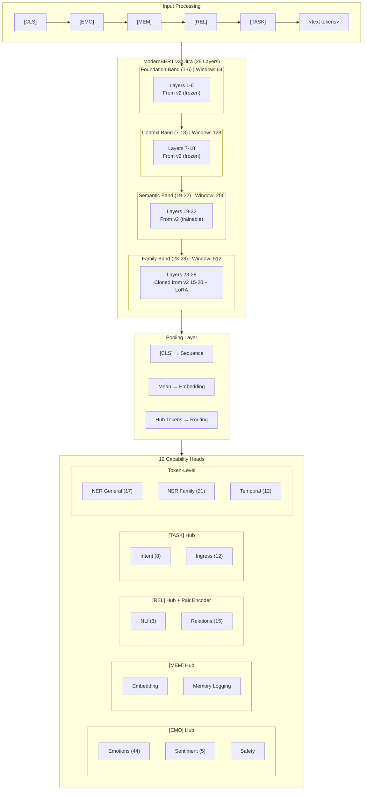

# ModernBERT v3 Ultra — Enhanced Multi-Task Architecture

**Version:** 3.2
**Date:** December 2025
**Codename:** Ultra
**Status:** Design Phase
**Strategy:** Function Preserving Growth (Weight Transfer from v2)

---

## Executive Summary

ModernBERT v3 Ultra is a **28-layer, 768-dimension** encoder architecture designed for FamilyOS multi-task inference. It introduces:

1. **Hub Tokens** — 4 specialized tokens (`[EMO]`, `[MEM]`, `[REL]`, `[TASK]`) for capability routing
2. **Multi-Scale Attention** — Flash Attention with sliding windows (64→128→256→512)
3. **Family Encoder Band** — Layers 23–28 (cloned from v2 layers 15–20) with LoRA adapters
4. **Function Preserving Growth** — Direct weight transfer from v2 (no distillation needed)
5. **Pair Encoder** — Cross-attention block for NLI and Relation extraction
6. **Future Upgrades** — GQA and SwiGLU available in Phase 2 (after stability)

**Target:** Edge-deployable (~200M params, <35ms/256 tokens on NPU)

---

## Training Philosophy: Function Preserving Growth

> **v3 inherits v2 weights directly via Function Preserving Growth.**
> **No distillation needed — we copy and clone transformer weights.**

**Why this works:**

- Hidden size unchanged: 768 → 768 ✅
- Attention unchanged: 12-head MHA → 12-head MHA ✅
- FFN unchanged: GELU → GELU ✅
- All v2 weight matrices load directly without any projection or reparameterization

**Weight Transfer Strategy:**

- ✅ **Layers 1–22**: Direct copy from v2 layers 1–22
- ✅ **Layers 23–28**: Cloned from v2 layers 15–20 (mature semantic processors)
- ✅ **Tokenizer & Vocabulary**: Reused from v2
- ✅ **Word Embeddings**: Direct copy from v2
- 🆕 **Hub Token Embeddings**: Random initialization (μ=0, σ=0.02)
- ❌ **Distillation**: NOT needed (weights transfer directly)

**Why clone layers 15–20 for 23–28?**

Layers 15–20 are high-level semantic processors in v2. Cloning them to 23–28 gives the new "Family Band" a strong starting point rather than random noise. During Phase 1 training, these cloned layers will diverge and specialize for family-specific reasoning.

---

## 1. Architecture Overview

### 1.1 v2 → v3 Comparison

| Aspect | v2 (Current) | v3 Ultra (Phase 1) | v3 Ultra (Phase 2) |
|--------|--------------|--------------------|--------------------|
| **Layers** | 22 | 28 | 28 |
| **Hidden Size** | 768 | 768 | 768 |
| **Attention Heads** | 12 (MHA) | 12 (MHA) | 16Q/4KV (GQA) |
| **Context Length** | 8,192 | 8,192 | 8,192 |
| **Attention Windows** | Global | 64→128→256→512 | 64→128→256→512 |
| **FFN** | GELU | GELU | SwiGLU |
| **Hub Tokens** | None | 4 tokens | 4 tokens |
| **Poolers** | CLS + Mean | CLS + Mean + Hub | CLS + Mean + Hub |
| **Pair Encoder** | None | Cross-attention | Cross-attention |
| **Adapters** | Task-grouped | LoRA (layers 23-28) | LoRA (layers 23-28) |
| **Parameters** | ~149M | ~200M | ~200M |
| **Target Latency** | ~50ms | <35ms | <30ms |

### 1.2 Layer Organization

```text
┌─────────────────────────────────────────────────────────────────┐
│                    ModernBERT v3 Ultra (28 Layers)              │
├─────────────────────────────────────────────────────────────────┤
│                                                                 │
│  ┌─────────────────────────────────────────────────────────┐   │
│  │  INPUT LAYER                                             │   │
│  │  [CLS] [EMO] [MEM] [REL] [TASK] <text tokens...>        │   │
│  │  Hub tokens prepended after CLS                          │   │
│  └─────────────────────────────────────────────────────────┘   │
│                              ↓                                  │
│  ┌─────────────────────────────────────────────────────────┐   │
│  │  FOUNDATION BAND (Layers 1-6)        Window: 64         │   │
│  │  • Copied from v2 layers 1-6 (FROZEN in Phase 1)        │   │
│  │  • Local token interactions                              │   │
│  │  • GELU FFN (MHA, 12 heads)                             │   │
│  └─────────────────────────────────────────────────────────┘   │
│                              ↓                                  │
│  ┌─────────────────────────────────────────────────────────┐   │
│  │  CONTEXT BAND (Layers 7-14)          Window: 128        │   │
│  │  • Copied from v2 layers 7-14 (FROZEN in Phase 1)       │   │
│  │  • Phrase-level understanding                            │   │
│  │  • GELU FFN (MHA, 12 heads)                             │   │
│  └─────────────────────────────────────────────────────────┘   │
│                              ↓                                  │
│  ┌─────────────────────────────────────────────────────────┐   │
│  │  CONTEXT BAND (Layers 15-18)         Window: 128        │   │
│  │  • Copied from v2 layers 15-18 (FROZEN in Phase 1)      │   │
│  │  • Upper phrase-level processing                         │   │
│  │  • GELU FFN (MHA, 12 heads)                             │   │
│  └─────────────────────────────────────────────────────────┘   │
│                              ↓                                  │
│  ┌─────────────────────────────────────────────────────────┐   │
│  │  SEMANTIC BAND (Layers 19-22)        Window: 256        │   │
│  │  • Copied from v2 layers 19-22 (TRAINABLE)              │   │
│  │  • Sentence-level semantics + Hub integration           │   │
│  │  • GELU FFN (MHA, 12 heads)                             │   │
│  └─────────────────────────────────────────────────────────┘   │
│                              ↓                                  │
│  ┌─────────────────────────────────────────────────────────┐   │
│  │  FAMILY BAND (Layers 23-28)          Window: 512        │   │
│  │  • CLONED from v2 layers 15-20 (TRAINABLE)              │   │
│  │  • LoRA adapters attached (r=16, α=16)                  │   │
│  │  • Family-specific representations                       │   │
│  │  • GELU FFN (MHA, 12 heads)                             │   │
│  │  • Hub token specialization                              │   │
│  └─────────────────────────────────────────────────────────┘   │
│                              ↓                                  │
│  ┌─────────────────────────────────────────────────────────┐   │
│  │  POOLER                                                  │   │
│  │  • [CLS] → Sequence classification tasks                │   │
│  │  • Mean Pool → Embedding tasks                          │   │
│  │  • Hub Token Pool → Capability-specific routing         │   │
│  └─────────────────────────────────────────────────────────┘   │
│                              ↓                                  │
│  ┌─────────────────────────────────────────────────────────┐   │
│  │  TASK HEADS (12 Capabilities)                           │   │
│  │  • Emotions, Sentiment, Safety → [EMO] token            │   │
│  │  • Embedding, Memory → [MEM] token                      │   │
│  │  • NLI, Relations → [REL] token + Pair Encoder         │   │
│  │  • Intent, Ingress → [TASK] token                       │   │
│  └─────────────────────────────────────────────────────────┘   │
│                                                                 │
└─────────────────────────────────────────────────────────────────┘
```

### 1.3 Architecture Diagram (Mermaid)



---

## 2. Hub Tokens

### 2.1 Token Definitions

Hub tokens are **special tokens prepended after [CLS]** that serve as capability routers. Each hub token aggregates information relevant to its assigned capabilities during the forward pass.

```python
# src/modeling_studio/models/hub_tokens.py

HUB_TOKENS = {
    "[EMO]": {
        "id": 50265,  # Reserved token ID
        "description": "Emotional/affective state routing",
        "capabilities": ["emotions", "sentiment", "safety_generic", "safety_familyos"],
        "initialization": "random",  # Trained from scratch
    },
    "[MEM]": {
        "id": 50266,
        "description": "Memory and embedding routing",
        "capabilities": ["embedding"],
        "initialization": "random",
    },
    "[REL]": {
        "id": 50267,
        "description": "Relational reasoning routing",
        "capabilities": ["nli", "relation"],
        "initialization": "random",
    },
    "[TASK]": {
        "id": 50268,
        "description": "Task/intent routing",
        "capabilities": ["intent", "ingress"],
        "initialization": "random",
    },
}
```

### 2.2 Hub Token Injection

```python
# src/modeling_studio/models/tokenization_v3.py

class HubTokenizer:
    """
    Wraps the base tokenizer to inject hub tokens.

    Input:  "Had dinner with family"
    Output: "[CLS] [EMO] [MEM] [REL] [TASK] Had dinner with family [SEP]"
    """

    HUB_TOKEN_IDS = [50265, 50266, 50267, 50268]  # [EMO], [MEM], [REL], [TASK]

    def __init__(self, base_tokenizer):
        self.tokenizer = base_tokenizer
        # Add hub tokens to vocabulary
        self.tokenizer.add_tokens(["[EMO]", "[MEM]", "[REL]", "[TASK]"])

    def __call__(self, text: str, **kwargs) -> dict:
        # Standard tokenization
        encoded = self.tokenizer(text, **kwargs)

        # Inject hub tokens after [CLS] (position 0)
        input_ids = encoded["input_ids"]
        attention_mask = encoded["attention_mask"]

        # Insert hub tokens at positions 1-4
        new_input_ids = [input_ids[0]] + self.HUB_TOKEN_IDS + input_ids[1:]
        new_attention_mask = [1] * (len(attention_mask) + 4)
        new_attention_mask[0] = attention_mask[0]
        new_attention_mask[5:] = attention_mask[1:]

        return {
            "input_ids": new_input_ids,
            "attention_mask": new_attention_mask,
            "hub_positions": [1, 2, 3, 4],  # [EMO], [MEM], [REL], [TASK]
        }
```

### 2.3 Hub Token Pooling

```python
# src/modeling_studio/models/poolers_v3.py

class HubTokenPooler(nn.Module):
    """
    Extract representations from hub token positions.

    Each hub token's final hidden state is used as the
    representation for its assigned capabilities.
    """

    HUB_POSITIONS = {
        "emo": 1,   # [EMO] at position 1
        "mem": 2,   # [MEM] at position 2
        "rel": 3,   # [REL] at position 3
        "task": 4,  # [TASK] at position 4
    }

    def forward(
        self,
        hidden_states: torch.Tensor,  # (batch, seq_len, hidden)
        hub_name: str,
    ) -> torch.Tensor:
        """Extract hidden state at hub token position."""
        position = self.HUB_POSITIONS[hub_name]
        return hidden_states[:, position, :]  # (batch, hidden)
```

### 2.4 Hub → Capability Mapping

| Hub Token | Position | Capabilities | Rationale |
|-----------|----------|--------------|-----------|
| `[EMO]` | 1 | emotions, sentiment, safety_generic, safety_familyos | Affective understanding |
| `[MEM]` | 2 | embedding | Memory retrieval & storage |
| `[REL]` | 3 | nli, relation | Entity & logical relationships |
| `[TASK]` | 4 | intent, ingress | User action classification |
| `[CLS]` | 0 | (fallback) | General sequence representation |
| Token-level | N/A | ner_general, ner_family, temporal | Per-token classification |

---

## 3. Multi-Scale Attention

### 3.1 Sliding Window Configuration

v3 uses **Flash Attention 2** with layer-wise sliding windows. Smaller windows in early layers capture local patterns; larger windows in later layers capture global context.

```python
# src/modeling_studio/models/attention_v3.py

LAYER_WINDOW_CONFIG = {
    # Foundation Band: Local token interactions
    1: 64, 2: 64, 3: 64, 4: 64, 5: 64, 6: 64,

    # Context Band: Phrase-level patterns
    7: 128, 8: 128, 9: 128, 10: 128, 11: 128, 12: 128, 13: 128, 14: 128,
    15: 128, 16: 128, 17: 128, 18: 128,

    # Semantic Band: Sentence-level semantics
    19: 256, 20: 256, 21: 256, 22: 256,

    # Family Band: Full context for family understanding
    23: 512, 24: 512, 25: 512, 26: 512, 27: 512, 28: 512,
}

def get_window_size(layer_idx: int) -> int:
    """Get sliding window size for a given layer."""
    return LAYER_WINDOW_CONFIG.get(layer_idx, 512)
```

### 3.2 Attention Implementation (Phase 1: MHA)

```python
# src/modeling_studio/models/attention_v3.py

from flash_attn import flash_attn_func

class MultiScaleAttention(nn.Module):
    """
    Multi-Head Attention with sliding windows (Phase 1).

    Phase 1 Config (matches v2 for weight loading):
    - Heads: 12 (standard MHA)
    - Window size: layer-dependent (64/128/256/512)

    Phase 2 Upgrade (future):
    - Convert to GQA (16Q/4KV) via head averaging
    """

    def __init__(
        self,
        hidden_size: int = 768,
        num_heads: int = 12,
        layer_idx: int = 1,
    ):
        super().__init__()
        self.hidden_size = hidden_size
        self.num_heads = num_heads
        self.head_dim = hidden_size // num_heads  # 768 / 12 = 64
        self.window_size = get_window_size(layer_idx)

        # Standard MHA projections (same as v2 for weight loading)
        self.q_proj = nn.Linear(hidden_size, hidden_size)
        self.k_proj = nn.Linear(hidden_size, hidden_size)
        self.v_proj = nn.Linear(hidden_size, hidden_size)
        self.o_proj = nn.Linear(hidden_size, hidden_size)

    def forward(
        self,
        hidden_states: torch.Tensor,
        attention_mask: torch.Tensor = None,
    ) -> torch.Tensor:
        batch_size, seq_len, _ = hidden_states.shape

        # Compute Q, K, V
        q = self.q_proj(hidden_states).view(batch_size, seq_len, self.num_heads, self.head_dim)
        k = self.k_proj(hidden_states).view(batch_size, seq_len, self.num_heads, self.head_dim)
        v = self.v_proj(hidden_states).view(batch_size, seq_len, self.num_heads, self.head_dim)

        # Flash Attention with sliding window
        attn_output = flash_attn_func(
            q, k, v,
            window_size=(self.window_size // 2, self.window_size // 2),
            causal=False,  # Encoder, not causal
        )

        # Reshape and project
        attn_output = attn_output.view(batch_size, seq_len, self.hidden_size)
        return self.o_proj(attn_output)
```

### 3.3 Window Size Rationale

| Band | Layers | Window | Purpose |
|------|--------|--------|---------|
| Foundation | 1-6 | 64 | Token-level patterns (morphology, subwords) |
| Context | 7-18 | 128 | Phrase patterns (entities, short phrases) |
| Semantic | 19-22 | 256 | Clause/sentence patterns (syntax, semantics) |
| Family | 23-28 | 512 | Full context (family dynamics, relationships) |

---

## 4. Transformer Block (Phase 1: v2-Compatible)

### 4.1 FFN (Phase 1: GELU)

Phase 1 uses **GELU FFN** to match v2 weights exactly. SwiGLU is a Phase 2 upgrade.

```python
# src/modeling_studio/models/ffn_v3.py

class GELUFFN(nn.Module):
    """
    Standard GELU Feed-Forward Network (matches v2 for weight loading).

    Phase 1: GELU (v2-compatible)
    Phase 2: Upgrade to SwiGLU via weight approximation
    """

    def __init__(
        self,
        hidden_size: int = 768,
        intermediate_size: int = 3072,  # 768 * 4 (standard)
        dropout: float = 0.1,
    ):
        super().__init__()
        self.dense_in = nn.Linear(hidden_size, intermediate_size)
        self.dense_out = nn.Linear(intermediate_size, hidden_size)
        self.activation = nn.GELU()
        self.dropout = nn.Dropout(dropout)

    def forward(self, x: torch.Tensor) -> torch.Tensor:
        x = self.dense_in(x)
        x = self.activation(x)
        x = self.dropout(x)
        x = self.dense_out(x)
        return x
```

### 4.2 Phase 2 Upgrades (Future)

GQA and SwiGLU are **deferred to Phase 2** after Phase 1 stability is confirmed.

```python
# Phase 2 Upgrade Path (NOT implemented in Phase 1)

# GQA Upgrade: Convert 12-head MHA to 16Q/4KV GQA
# Method: Average groups of 3 K/V heads into 1 shared head
# - Original: 12 K heads, 12 V heads
# - Target: 4 K heads, 4 V heads (shared by 4 Q heads each)

# SwiGLU Upgrade: Convert GELU FFN to SwiGLU
# Method: Split intermediate weights, approximate GELU with SiLU
# - May require brief fine-tuning after conversion

# SAFETY VALVE: If Phase 2 upgrades prove unstable,
# v3 can remain in Phase 1 state (MHA/GELU) and still be
# deployed as "v3" due to the extra depth and Hub Tokens.
```

### 4.3 Complete Transformer Layer (Phase 1)

```python
# src/modeling_studio/models/layers_v3.py

class ModernBERTLayerV3(nn.Module):
    """
    v3 Transformer layer (Phase 1: v2-compatible).

    Phase 1 features:
    - Multi-Head Attention (12 heads, matches v2)
    - Multi-scale sliding windows (64/128/256/512)
    - GELU FFN (matches v2)
    - LayerNorm (matches v2)
    - Optional LoRA adapters (layers 23-28)
    """

    def __init__(
        self,
        hidden_size: int = 768,
        layer_idx: int = 1,
        use_lora: bool = False,
        lora_r: int = 16,
        lora_alpha: int = 16,
        lora_dropout: float = 0.05,
    ):
        super().__init__()
        self.layer_idx = layer_idx

        # LayerNorm (matches v2)
        self.input_layernorm = nn.LayerNorm(hidden_size)
        self.post_attention_layernorm = nn.LayerNorm(hidden_size)

        # Attention (MHA with sliding window)
        self.attention = MultiScaleAttention(
            hidden_size=hidden_size,
            num_heads=12,  # Standard MHA (matches v2)
            layer_idx=layer_idx,
        )

        # FFN (GELU, matches v2)
        self.ffn = GELUFFN(
            hidden_size=hidden_size,
            intermediate_size=hidden_size * 4,  # 768 * 4 = 3072
        )

        # LoRA (only for layers 23-28 = Family Band)
        self.use_lora = use_lora and layer_idx >= 23
        if self.use_lora:
            self.lora_q = LoRALayer(hidden_size, lora_r, lora_alpha, lora_dropout)
            self.lora_v = LoRALayer(hidden_size, lora_r, lora_alpha, lora_dropout)

    def forward(
        self,
        hidden_states: torch.Tensor,
        attention_mask: torch.Tensor = None,
    ) -> torch.Tensor:
        # Pre-norm attention
        residual = hidden_states
        hidden_states = self.input_layernorm(hidden_states)
        hidden_states = self.attention(hidden_states, attention_mask)

        # Add LoRA if enabled
        if self.use_lora:
            hidden_states = hidden_states + self.lora_q(residual) + self.lora_v(residual)

        hidden_states = residual + hidden_states

        # Pre-norm FFN
        residual = hidden_states
        hidden_states = self.post_attention_layernorm(hidden_states)
        hidden_states = self.ffn(hidden_states)
        hidden_states = residual + hidden_states

        return hidden_states
```

---

## 5. LoRA Adapters

### 5.1 Configuration

LoRA adapters are attached to **layers 23-28** (Family Band) for capability-specific fine-tuning.

```yaml
# configs/training/multitask/stage_v3.yaml

lora:
  enabled: true
  target_layers: [23, 24, 25, 26, 27, 28]  # Family Band (cloned layers)
  target_modules: ["q_proj", "v_proj"]  # Q and V attention projections
  r: 16                            # Rank
  alpha: 16                        # Scaling factor (alpha/r = 1)
  dropout: 0.05                    # LoRA dropout
  bias: "none"                     # No bias training

  # Per-capability LoRA (optional, for future)
  capability_specific: false       # All capabilities share same LoRA for now
```

### 5.2 LoRA Implementation

```python
# src/modeling_studio/models/lora_v3.py

class LoRALayer(nn.Module):
    """
    Low-Rank Adaptation layer.

    W' = W + BA where:
    - W: frozen pretrained weights
    - B: (hidden_size, r) learned
    - A: (r, hidden_size) learned
    - Scaling: alpha / r
    """

    def __init__(
        self,
        hidden_size: int,
        r: int = 16,
        alpha: int = 16,
        dropout: float = 0.05,
    ):
        super().__init__()
        self.r = r
        self.scaling = alpha / r

        # LoRA matrices
        self.lora_A = nn.Linear(hidden_size, r, bias=False)
        self.lora_B = nn.Linear(r, hidden_size, bias=False)
        self.lora_dropout = nn.Dropout(dropout)

        # Initialize A with Kaiming, B with zeros
        nn.init.kaiming_uniform_(self.lora_A.weight, a=math.sqrt(5))
        nn.init.zeros_(self.lora_B.weight)

    def forward(self, x: torch.Tensor) -> torch.Tensor:
        """Compute LoRA delta: scaling * B(A(dropout(x)))"""
        return self.scaling * self.lora_B(self.lora_A(self.lora_dropout(x)))
```

### 5.3 Why Layers 23-28?

| Layer Range | Source | Training Mode | Rationale |
|-------------|--------|---------------|-----------|
| 1-6 (Foundation) | v2 layers 1-6 | Frozen | Core token representations, well-pretrained |
| 7-18 (Context) | v2 layers 7-18 | Frozen | Phrase patterns, transfer well |
| 19-22 (Semantic) | v2 layers 19-22 | Trainable | Buffer to integrate Hub tokens |
| 23-28 (Family) | Cloned from v2 15-20 | Trainable + LoRA | New capacity for FamilyOS-specific logic |

---

## 6. Pair Encoder

### 6.1 Purpose

The Pair Encoder handles tasks requiring **reasoning over entity pairs**:

- **NLI**: Premise-hypothesis entailment
- **Relation Extraction**: Subject-object relationships

### 6.2 Architecture

```python
# src/modeling_studio/models/pair_encoder_v3.py

class PairEncoder(nn.Module):
    """
    Cross-encoder for pair-based reasoning.

    Unlike bi-encoders that encode separately, cross-encoders
    allow full attention between both sequences for richer interaction.

    For NLI: (premise, hypothesis) → entailment/neutral/contradiction
    For Relations: (subject_span, object_span) → relation_type
    """

    def __init__(
        self,
        hidden_size: int = 768,  # Same as v2
        num_heads: int = 8,
        dropout: float = 0.1,
    ):
        super().__init__()

        # Cross-attention: sequence attends to spans
        self.cross_attention = nn.MultiheadAttention(
            embed_dim=hidden_size,
            num_heads=num_heads,
            dropout=dropout,
            batch_first=True,
        )

        # Span extraction projections
        self.span_proj = nn.Linear(hidden_size, hidden_size)

        # Fusion layer
        self.fusion = nn.Sequential(
            nn.Linear(hidden_size * 3, hidden_size),  # [REL] + span_a + span_b
            nn.GELU(),
            nn.Dropout(dropout),
            nn.Linear(hidden_size, hidden_size),
        )

        self.layer_norm = nn.LayerNorm(hidden_size)

    def forward(
        self,
        hidden_states: torch.Tensor,      # (batch, seq_len, hidden)
        span_a_mask: torch.Tensor,         # (batch, seq_len) - first entity/premise
        span_b_mask: torch.Tensor,         # (batch, seq_len) - second entity/hypothesis
        rel_token_position: int = 3,       # [REL] token position
    ) -> torch.Tensor:
        """
        Returns pair representation for classification.
        """
        batch_size = hidden_states.size(0)

        # Extract [REL] token representation
        rel_repr = hidden_states[:, rel_token_position, :]  # (batch, hidden)

        # Extract span representations (mean pool over span tokens)
        span_a_repr = self._extract_span(hidden_states, span_a_mask)
        span_b_repr = self._extract_span(hidden_states, span_b_mask)

        # Cross-attention: rel_repr attends to both spans
        spans_combined = torch.stack([span_a_repr, span_b_repr], dim=1)  # (batch, 2, hidden)
        cross_out, _ = self.cross_attention(
            query=rel_repr.unsqueeze(1),   # (batch, 1, hidden)
            key=spans_combined,
            value=spans_combined,
        )
        cross_out = cross_out.squeeze(1)  # (batch, hidden)

        # Fusion: combine all representations
        combined = torch.cat([rel_repr, span_a_repr, span_b_repr], dim=-1)
        fused = self.fusion(combined)

        # Residual + norm
        output = self.layer_norm(cross_out + fused)

        return output

    def _extract_span(
        self,
        hidden_states: torch.Tensor,
        span_mask: torch.Tensor,
    ) -> torch.Tensor:
        """Mean pool over span tokens."""
        span_mask = span_mask.unsqueeze(-1).float()
        span_sum = (hidden_states * span_mask).sum(dim=1)
        span_len = span_mask.sum(dim=1).clamp(min=1)
        return self.span_proj(span_sum / span_len)
```

### 6.3 Usage Examples

```python
# NLI Example
premise = "The cat sat on the mat"
hypothesis = "An animal is on the floor"
# Tokenized: [CLS] [EMO] [MEM] [REL] [TASK] <premise> [SEP] <hypothesis> [SEP]
# span_a_mask: marks premise tokens
# span_b_mask: marks hypothesis tokens
# Output: entailment

# Relation Example
text = "Mom took Panda to the park"
# Tokenized: [CLS] [EMO] [MEM] [REL] [TASK] Mom took Panda to the park [SEP]
# span_a_mask: marks "Mom"
# span_b_mask: marks "Panda"
# Output: parent_of
```

---

## 7. Complete Model Architecture

### 7.1 Model Definition

```python
# src/modeling_studio/models/modernbert_v3.py

class ModernBERTv3Ultra(nn.Module):
    """
    ModernBERT v3 Ultra: 28-layer, 768-dim multi-task encoder.

    Phase 1 Features (Pragmatic Option B):
    - Hub tokens for capability routing ([EMO], [MEM], [REL], [TASK])
    - Multi-scale sliding window attention (64→128→256→512)
    - Standard MHA (12 heads) - Phase 2: upgrade to GQA
    - GELU FFN - Phase 2: upgrade to SwiGLU
    - LoRA adapters on layers 23-28
    - Pair encoder for NLI/Relation
    - 12 capability heads
    - Direct weight transfer from v2 (Function Preserving Growth)
    """

    def __init__(self, config: ModernBERTv3Config):
        super().__init__()
        self.config = config

        # Embeddings (includes hub tokens)
        self.embeddings = ModernBERTv3Embeddings(config)

        # Encoder layers (28 total)
        self.layers = nn.ModuleList([
            ModernBERTLayerV3(
                hidden_size=config.hidden_size,
                layer_idx=i + 1,
                use_lora=(i + 1) >= 25,  # LoRA for layers 25-28
                lora_r=config.lora_r,
                lora_alpha=config.lora_alpha,
            )
            for i in range(config.num_hidden_layers)
        ])

        # Poolers
        self.cls_pooler = CLSPooler(config.hidden_size)
        self.mean_pooler = MeanPooler()
        self.hub_pooler = HubTokenPooler()

        # Pair encoder (for NLI, Relation)
        self.pair_encoder = PairEncoder(
            hidden_size=config.hidden_size,
            num_heads=8,
        )

        # Capability heads
        self.heads = nn.ModuleDict({
            # [EMO] Hub
            "emotions": EmotionHead(config.hidden_size, num_labels=44),
            "sentiment": SentimentHead(config.hidden_size, num_labels=5),
            "safety_generic": SafetyHead(config.hidden_size, num_labels=8),
            "safety_familyos": HierarchicalSafetyHead(config.hidden_size),

            # [MEM] Hub
            "embedding": EmbeddingHead(config.hidden_size, output_dim=768),

            # [REL] Hub (uses pair encoder)
            "nli": NLIHead(config.hidden_size, num_labels=3),
            "relation": RelationHead(config.hidden_size, num_labels=15),

            # [TASK] Hub
            "intent": IntentHead(config.hidden_size, num_labels=8),
            "ingress": IngressHead(config.hidden_size, num_labels=12),

            # Token-level (use full sequence)
            "ner_general": NERHead(config.hidden_size, num_labels=17),
            "ner_family": NERHead(config.hidden_size, num_labels=21),
            "temporal": TemporalHead(config.hidden_size, num_labels=12),
        })

    def forward(
        self,
        input_ids: torch.Tensor,
        attention_mask: torch.Tensor,
        task: str = None,
        span_a_mask: torch.Tensor = None,  # For pair tasks
        span_b_mask: torch.Tensor = None,
        **kwargs,
    ) -> dict:
        # Embeddings
        hidden_states = self.embeddings(input_ids)

        # Encoder forward
        for layer in self.layers:
            hidden_states = layer(hidden_states, attention_mask)

        # Get representations based on task
        outputs = {"hidden_states": hidden_states}

        if task is None:
            return outputs

        # Route to appropriate pooler based on task
        if task in ["emotions", "sentiment", "safety_generic", "safety_familyos"]:
            repr = self.hub_pooler(hidden_states, "emo")
        elif task == "embedding":
            repr = self.mean_pooler(hidden_states, attention_mask)
        elif task in ["nli", "relation"]:
            repr = self.pair_encoder(hidden_states, span_a_mask, span_b_mask)
        elif task in ["intent", "ingress"]:
            repr = self.hub_pooler(hidden_states, "task")
        else:
            # Token-level tasks
            repr = hidden_states

        # Head forward
        outputs["logits"] = self.heads[task](repr)

        return outputs
```

### 7.2 Configuration

```python
# src/modeling_studio/models/config_v3.py

@dataclass
class ModernBERTv3Config:
    """Configuration for ModernBERT v3 Ultra (Pragmatic Option B - Phase 1)."""

    # Model architecture (SAME as v2 to allow direct weight loading)
    hidden_size: int = 768             # Same as v2 (NOT 896)
    num_hidden_layers: int = 28        # Extended from v2's 22
    num_attention_heads: int = 12      # Same as v2, MHA (Phase 2: upgrade to GQA)
    intermediate_size: int = 3072      # 768 * 4 (GELU standard)
    max_position_embeddings: int = 8192
    vocab_size: int = 50269            # Base + 4 hub tokens

    # Attention (Phase 1: MHA with sliding windows)
    attention_type: str = "flash_attention_2"
    window_sizes: list = field(default_factory=lambda: [64, 128, 256, 512])
    # Phase 2 upgrade: GQA with num_kv_heads = 4

    # FFN (Phase 1: GELU standard)
    ffn_type: str = "gelu"             # Phase 2 upgrade: SwiGLU
    ffn_expansion: int = 4             # Standard 4x expansion

    # LoRA (applied to new/cloned layers 23-28)
    lora_r: int = 16
    lora_alpha: int = 16
    lora_dropout: float = 0.05
    lora_layers: list = field(default_factory=lambda: [23, 24, 25, 26, 27, 28])

    # Hub tokens (randomly initialized)
    hub_tokens: list = field(default_factory=lambda: ["[EMO]", "[MEM]", "[REL]", "[TASK]"])

    # Layer composition
    layer_source: dict = field(default_factory=lambda: {
        "1-22": "copy_from_v2",        # Direct weight loading
        "23-28": "clone_from_v2_15-20" # Function preserving growth
    })

    # Capabilities
    capabilities: list = field(default_factory=lambda: [
        "emotions", "sentiment", "safety_generic", "safety_familyos",
        "embedding", "nli", "relation", "intent", "ingress",
        "ner_general", "ner_family", "temporal",
    ])
```

---

## 8. Training Strategy (Function Preserving Growth)

### 8.1 Weight Loading from v2

```python
# src/modeling_studio/models/initialization_v3.py

def build_v3_from_v2(v2_checkpoint_path: str) -> ModernBERTv3Ultra:
    """
    Create v3 model using Function Preserving Growth from v2.

    Layer Composition:
      - Layers 1-22: Direct copy from v2
      - Layers 23-28: Cloned from v2 layers 15-20 (valid semantic processors)
      - Hub tokens: Random initialization
      - Task heads: New random initialization
    """

    # Load v2 model
    v2 = ModernBERTv2.from_pretrained(v2_checkpoint_path)
    config = ModernBERTv3Config()

    # Create empty v3 model
    v3 = ModernBERTv3Ultra(config)

    with torch.no_grad():
        # 1. Copy embeddings (768-dim matches exactly)
        v3.embeddings.word_embeddings.weight[:50265] = \
            v2.embeddings.word_embeddings.weight.clone()

        # 2. Random init hub tokens [EMO], [MEM], [REL], [TASK]
        nn.init.normal_(v3.embeddings.word_embeddings.weight[50265:], std=0.02)

        # 3. Copy layers 1-22 directly
        for i in range(22):
            v3.encoder.layers[i].load_state_dict(
                v2.encoder.layers[i].state_dict()
            )
            print(f"Layer {i+1}: Copied from v2 layer {i+1}")

        # 4. Clone layers 23-28 from v2 layers 15-20
        source_layers = [14, 15, 16, 17, 18, 19]  # 0-indexed: v2 layers 15-20
        for i, src in enumerate(source_layers):
            v3.encoder.layers[22 + i].load_state_dict(
                v2.encoder.layers[src].state_dict()
            )
            print(f"Layer {23 + i}: Cloned from v2 layer {src + 1}")

        # 5. Copy pooler if exists
        if hasattr(v2, 'pooler') and hasattr(v3, 'pooler'):
            v3.pooler.load_state_dict(v2.pooler.state_dict())

    print("\n✓ v3 initialized from v2 via Function Preserving Growth")
    print(f"  - Layers 1-22: Copied from v2")
    print(f"  - Layers 23-28: Cloned from v2 layers 15-20")
    print(f"  - Hub tokens: Random initialization")

    return v3


def verify_function_preserving(v2, v3, sample_inputs):
    """Verify v3 produces same outputs as v2 for first 22 layers."""
    with torch.no_grad():
        v2_hidden = v2.encoder(sample_inputs, output_hidden_states=True)
        v3_hidden = v3.encoder(sample_inputs, output_hidden_states=True)

        for i in range(22):
            diff = (v2_hidden[i] - v3_hidden[i]).abs().max().item()
            assert diff < 1e-5, f"Layer {i+1} mismatch: {diff}"
            print(f"Layer {i+1}: ✓ Match (max diff: {diff:.2e})")

    print("\n✓ Function Preserving verification passed!")
```

### 8.2 Layer Freezing Strategy

```python
# src/modeling_studio/trainers/v3_trainer.py

def configure_trainable_layers(model: ModernBERTv3Ultra, phase: int):
    """
    Configure which layers are trainable based on training phase.

    Phase 1 Strategy:
      - Freeze layers 1-18 (core v2 knowledge)
      - Train layers 19-28 (upper semantic + new cloned)
      - Train hub tokens (new capability anchors)
      - Train all task heads (new random init)
    """

    # First, freeze everything
    for param in model.parameters():
        param.requires_grad = False

    if phase == 1:
        # Unfreeze layers 19-28
        for i in range(18, 28):  # 0-indexed: layers 19-28
            for param in model.encoder.layers[i].parameters():
                param.requires_grad = True
            print(f"Layer {i+1}: 🔥 Trainable")

        # Unfreeze hub token embeddings (indices 50265-50268)
        model.embeddings.word_embeddings.weight.requires_grad = True
        # Note: We'll mask gradients for non-hub tokens in training loop

        # Unfreeze all task heads
        for head in model.heads.values():
            for param in head.parameters():
                param.requires_grad = True

        # Unfreeze pair encoder
        if hasattr(model, 'pair_encoder'):
            for param in model.pair_encoder.parameters():
                param.requires_grad = True

        print(f"\nPhase 1 Configuration:")
        print(f"  ❄️ Frozen: Layers 1-18")
        print(f"  🔥 Trainable: Layers 19-28")
        print(f"  🔥 Trainable: Hub tokens [EMO], [MEM], [REL], [TASK]")
        print(f"  🔥 Trainable: All task heads")
        print(f"  🔥 Trainable: Pair encoder")


def apply_lora_to_model(model: ModernBERTv3Ultra):
    """Apply LoRA adapters to layers 23-28 (the cloned layers)."""

    lora_config = {
        "r": 16,
        "alpha": 16,
        "dropout": 0.05,
        "target_modules": ["q_proj", "k_proj", "v_proj", "o_proj", "ffn.fc1", "ffn.fc2"],
    }

    for i in range(22, 28):  # 0-indexed: layers 23-28
        layer = model.encoder.layers[i]

        # Apply LoRA to attention projections
        layer.attention.q_proj = LoRALinear(
            layer.attention.q_proj, r=16, alpha=16, dropout=0.05
        )
        layer.attention.k_proj = LoRALinear(
            layer.attention.k_proj, r=16, alpha=16, dropout=0.05
        )
        layer.attention.v_proj = LoRALinear(
            layer.attention.v_proj, r=16, alpha=16, dropout=0.05
        )
        layer.attention.o_proj = LoRALinear(
            layer.attention.o_proj, r=16, alpha=16, dropout=0.05
        )

        print(f"Layer {i+1}: LoRA applied (r=16, α=16)")

    print(f"\n✓ LoRA applied to layers 23-28")
```

### 8.3 Phase Overview

```yaml
# v3 Training Phases (Function Preserving Growth)

Phase 0 – Model Initialization:
  action: Build 28-layer v3 from v2 checkpoint
  layers_1_22: Direct copy from v2 (unchanged)
  layers_23_28: Clone from v2 layers 15-20
  embeddings:
    - vocab_tokens: Copy from v2 (768-dim, no projection needed)
    - hub_tokens: Random initialization [EMO], [MEM], [REL], [TASK]
  task_heads: New random initialization
  verification: Run sanity check to ensure layers 1-22 produce identical outputs
  output: modernbert-v3-initialized

Phase 1 – Function Preserving Training:
  description: Train upper layers + hub tokens while preserving core v2 knowledge
  frozen_layers: 1-18 (core semantic understanding)
  trainable:
    - Layers 19-28 (upper semantic processing)
    - Hub tokens (new capability anchors)
    - All task heads (new random init)
    - Pair encoder (new for NLI/Relation)
  lora: Applied to layers 23-28 (r=16, α=16)
  data: Full multi-task data (same as v2 Stage A)
  epochs: 10
  learning_rate:
    layers_19_22: 2e-5 (conservative, these are v2 originals)
    layers_23_28: 5e-5 (higher, these are cloned)
    lora: 1e-4 (standard LoRA rate)
    hub_tokens: 1e-4 (need to learn task routing)
    heads: 1e-4
  output: modernbert-v3-phase1

Phase 1.5 – Forgetting Evaluation (No Training):
  input: modernbert-v3-phase1
  steps:
    - Evaluate on v2 benchmarks (CoNLL, SST-2, MNLI)
    - Check for catastrophic forgetting (max 2% drop allowed)
    - If forgetting detected: increase frozen layers or add replay
  gate: Must pass before proceeding

Phase 2 – Architecture Upgrade (FUTURE):
  description: Upgrade to GQA + SwiGLU via reparameterization
  prerequisites:
    - Phase 1 model meets all quality targets
    - No significant forgetting detected
  upgrades:
    - MHA (12 heads) → GQA (12 Q heads, 4 KV heads)
    - GELU FFN → SwiGLU FFN
  method: Reparameterization (not retraining)
  output: modernbert-v3-phase2

Safety Valve:
  note: |
    If Phase 2 upgrades prove unstable or degrade quality,
    we can deploy Phase 1 model as production "v3".
    Phase 1 already has all capability improvements (hub tokens,
    extra layers, pair encoder) - just without efficiency gains.

Final – Calibration & Export:
  - Temperature scaling per head
  - Safety threshold optimization
  - Merge LoRA weights into base model
  - Export unified model (~400MB, same size as v2)
  - ONNX export for NPU deployment
```

### 8.4 Training Schedule (Function Preserving)

| Phase | Layers 1-18 | Layers 19-22 | Layers 23-28 | Hub Tokens | Heads | LoRA |
|-------|-------------|--------------|--------------|------------|-------|------|
| 0 (Init) | Copy v2 | Copy v2 | Clone 15-20 | Random | Random | - |
| 1 (Train) | ❄️ Frozen | 🔥 Train (2e-5) | 🔥 Train + LoRA (5e-5) | 🔥 Train (1e-4) | 🔥 Train (1e-4) | r=16 |
| 1.5 (Eval) | ❄️ Frozen | ❄️ Frozen | ❄️ Frozen | ❄️ Frozen | Eval only | - |
| 2 (Upgrade) | GQA/SwiGLU | GQA/SwiGLU | GQA/SwiGLU | - | - | Merge |

### 8.5 Training Configuration

```yaml
# configs/training/multitask/stage_v3_phase1.yaml

model:
  name: ModernBERTv3Ultra
  hidden_size: 768          # Same as v2
  num_layers: 28
  num_attention_heads: 12   # MHA (Phase 1)
  ffn_type: gelu            # Standard (Phase 1)
  hub_tokens: true
  pair_encoder: true

initialization:
  method: function_preserving_growth
  source: checkpoints/modernbert-unified-v2
  layers_1_22: copy
  layers_23_28: clone_from_15_20
  hub_tokens: random
  verify_function_preserving: true

training:
  # Phase 1 - Function Preserving Training
  phase_1:
    epochs: 10
    batch_size: 64
    gradient_accumulation: 8  # Effective batch: 512
    learning_rate:
      layers_19_22: 2e-5      # Conservative (v2 originals)
      layers_23_28: 5e-5      # Higher (cloned layers)
      lora: 1e-4
      hub_tokens: 1e-4
      heads: 1e-4
      pair_encoder: 1e-4
    frozen_layers: [1, 2, 3, 4, 5, 6, 7, 8, 9, 10, 11, 12, 13, 14, 15, 16, 17, 18]
    lora:
      enabled: true
      r: 16
      alpha: 16
      dropout: 0.05
      target_layers: [23, 24, 25, 26, 27, 28]
    warmup_ratio: 0.1

# Progressive regularization (from v2)
progressive_regularization:
  r_drop:
    start_epoch: 2
    alpha: 0.5
  mixup:
    start_epoch: 2
    alpha: 0.3
  adversarial:
    start_epoch: 4
    epsilon: 0.01

# Safety oversampling (from v2)
safety:
  crisis_oversampling: 20
  red_oversampling: 5
  loss_weight: 15

# EMA (from v2)
ema:
  enabled: true
  decay: 0.999

# Forgetting gates
forgetting_evaluation:
  enabled: true
  after_phase: 1
  benchmarks:
    - name: CoNLL-2003
      metric: F1
      max_drop: 0.02
    - name: SST-2
      metric: accuracy
      max_drop: 0.02
    - name: MNLI
      metric: accuracy
      max_drop: 0.02
  action_on_failure: increase_frozen_layers
```

---

## 9. Quality Targets

### 9.1 Capability Targets

| Capability | Metric | v2 Target | v3 Target | Improvement |
|------------|--------|-----------|-----------|-------------|
| ner_general | F1 | 91% | 93% | +2% |
| ner_family | F1 | 88% | 91% | +3% |
| sentiment | Accuracy | 94% | 96% | +2% |
| emotions | Macro F1 | 78% | 82% | +4% |
| safety_familyos | CRISIS Recall | 98% | **99%** | +1% |
| safety_familyos | Cultural FP | ≤2% | **≤1%** | Better |
| ingress | Accuracy | 92% | 95% | +3% |
| relation | F1 | 82% | 87% | +5% |
| intent | Accuracy | 90% | 93% | +3% |
| temporal | F1 | 85% | 89% | +4% |
| nli | Accuracy | 88% | 91% | +3% |
| embedding | Recall@10 | 85% | 90% | +5% |

### 9.2 Latency Targets

| Platform | v2 Latency | v3 Phase 1 | v3 Phase 2 | Notes |
|----------|------------|------------|------------|-------|
| A100 GPU | ~15ms | ~18ms | <12ms | Phase 1: +6 layers overhead; Phase 2: GQA recovery |
| RTX 4090 | ~25ms | ~30ms | <20ms | Consumer GPU |
| Ryzen AI NPU | ~60ms | ~72ms | <35ms | Edge deployment; Phase 2 big win with GQA |
| Apple M3 Neural | ~45ms | ~55ms | <30ms | macOS edge |

#### Phase 1 Reality Check

- Phase 1 will be ~20% slower than v2 due to 6 extra layers (28 vs 22)
- Same hidden size (768) so memory footprint similar
- Model size: ~400MB (same as v2)

#### Phase 2 Efficiency Gains

- GQA: 4 KV heads instead of 12 → 3x KV cache reduction
- SwiGLU: More efficient activations
- Combined: Should recover Phase 1 overhead + additional gains

### 9.3 Forgetting Gates (from v2)

After Phase B training, evaluate on Phase A benchmarks:

| Benchmark | Max Allowed Drop | Action if Exceeded |
|-----------|------------------|--------------------|
| CoNLL-2003 (NER) | ≤ 2% F1 | Increase replay ratio |
| SST-2 (Sentiment) | ≤ 2% Acc | Increase replay ratio |
| MNLI (NLI) | ≤ 2% Acc | Increase replay ratio |
| FamilyOS Emotions | ≤ 3% F1 | Reduce LoRA r |

---

## 10. Implementation Roadmap

### 10.1 File Structure

```text
src/modeling_studio/
├── models/
│   ├── config_v3.py              # v3 configuration
│   ├── modernbert_v3.py          # Main v3 model
│   ├── attention_v3.py           # MHA + sliding windows (Phase 2: GQA)
│   ├── layers_v3.py              # Transformer layers (GELU FFN)
│   ├── hub_tokens.py             # Hub token definitions
│   ├── tokenization_v3.py        # Hub token injection
│   ├── poolers_v3.py             # CLS, Mean, Hub poolers
│   ├── pair_encoder_v3.py        # Cross-attention pair encoder
│   ├── lora_v3.py                # LoRA implementation
│   └── heads_v3.py               # 12 capability heads
├── trainers/
│   ├── trainer_v3.py             # v3 trainer with layer freezing
│   ├── initialize_v3.py          # Function Preserving Growth from v2
│   └── hub_token_trainer.py      # Hub token specific training
└── data/
    └── collators_v3.py           # Collators with hub token support
```

### 10.2 Implementation Order

| Priority | Component | Effort | Dependencies |
|----------|-----------|--------|--------------|
| 1 | `config_v3.py` | 1 day | None |
| 2 | `attention_v3.py` (MHA + sliding windows) | 2 days | config_v3 |
| 3 | `layers_v3.py` | 2 days | attention_v3 |
| 4 | `hub_tokens.py` + `tokenization_v3.py` | 2 days | None |
| 5 | `poolers_v3.py` | 1 day | hub_tokens |
| 6 | `lora_v3.py` | 1 day | None |
| 7 | `pair_encoder_v3.py` | 2 days | poolers_v3 |
| 8 | `modernbert_v3.py` (integration) | 3 days | All above |
| 9 | `initialize_v3.py` (Function Preserving Growth) | 2 days | modernbert_v3 |
| 10 | `trainer_v3.py` (layer freezing trainer) | 2 days | initialize_v3 |
| 11 | Testing + validation | 3 days | All above |
| 12 | Phase 2: GQA/SwiGLU upgrade (optional) | 4 days | Phase 1 complete |

#### Total: ~21 days (Phase 1) + 4 days (Phase 2 optional)

---

## 11. v2 → v3 Weight Transfer (Function Preserving Growth)

### 11.1 Direct Weight Loading

v3 uses **direct weight transfer** from v2 because architecture is compatible:

```python
# scripts/initialize_v3_from_v2.py

def build_v3_from_v2(v2_checkpoint: str) -> ModernBERTv3Ultra:
    """
    Initialize v3 model via Function Preserving Growth.

    Because v3 Phase 1 uses:
    - Same hidden size (768)
    - Same attention (12-head MHA)
    - Same FFN (GELU)

    We can directly copy weights!

    Layer Composition:
    - Layers 1-22: Direct copy from v2
    - Layers 23-28: Clone from v2 layers 15-20
    - Hub tokens: Random initialization (new tokens)
    """
    # Load v2 model
    v2_model = ModernBERTv2.from_pretrained(v2_checkpoint)
    v2_embeddings = v2_model.embeddings.word_embeddings.weight  # [V, 768]

    # Create v3 config and model
    v3_config = ModernBERTv3Config()
    v3_model = ModernBERTv3Ultra(v3_config)

    with torch.no_grad():
        # 1. Copy word embeddings (768-dim, exact match)
        vocab_size = v2_embeddings.size(0)  # 50265
        v3_model.embeddings.word_embeddings.weight[:vocab_size] = v2_embeddings.clone()

        # 2. Hub tokens are random (indices 50265-50268)
        nn.init.normal_(v3_model.embeddings.word_embeddings.weight[vocab_size:], std=0.02)

        # 3. Copy transformer layers 1-22
        for i in range(22):
            v3_model.encoder.layers[i].load_state_dict(
                v2_model.encoder.layers[i].state_dict()
            )

        # 4. Clone v2 layers 15-20 → v3 layers 23-28
        source_indices = [14, 15, 16, 17, 18, 19]  # 0-indexed
        for i, src in enumerate(source_indices):
            v3_model.encoder.layers[22 + i].load_state_dict(
                v2_model.encoder.layers[src].state_dict()
            )

        # 5. Copy pooler if exists
        if hasattr(v2_model, 'pooler'):
            v3_model.pooler.load_state_dict(v2_model.pooler.state_dict())

    return v3_model
```

### 11.2 What Gets Transferred

| Component | Transfer Method | Rationale |
|-----------|-----------------|-----------|
| **Word Embeddings** | Direct copy (768-dim) | Same hidden size, perfect match |
| **Position Embeddings** | Direct copy | Same sequence length |
| **Hub Token Embeddings** | Random init | New tokens, no prior knowledge |
| **Transformer Layers 1-22** | Direct copy from v2 | Architecture matches exactly |
| **Transformer Layers 23-28** | Clone from v2 L15-20 | Function preserving growth |
| **Pooler** | Direct copy | Same architecture |
| **Capability Heads** | Random init | New heads for v3 task mix |

### 11.3 Why Pragmatic Option B Works

```python
# Key insight: By keeping 768-dim, MHA, GELU in Phase 1,
# we get DIRECT weight loading instead of distillation

# Comparison:
#
# Original v3 Plan (896-dim, GQA, SwiGLU):
#   - Cannot load v2 weights (dimension mismatch)
#   - Requires knowledge distillation (slower, lossy)
#   - Risk of not matching v2 quality
#
# Pragmatic Option B (768-dim, MHA, GELU):
#   - Direct weight loading from v2 ✓
#   - Guaranteed to match v2 on layers 1-22 ✓
#   - Phase 2 upgrades GQA/SwiGLU later (optional)
```

### 11.4 Backward Compatibility

```python
# v3 produces same outputs as v2 (same capability set)
# Inference API is identical

# v2 inference
outputs_v2 = model_v2(input_ids, attention_mask, task="emotions")

# v3 inference (same API)
outputs_v3 = model_v3(input_ids, attention_mask, task="emotions")

# Output format is the same: {"logits": ..., "hidden_states": ...}
```

---

## 12. Summary: v2 → v3 Changes

| Aspect | v2 | v3 Phase 1 | v3 Phase 2 (Future) | Notes |
|--------|----|----|-----|-------|
| **Layers** | 22 | 28 | 28 | +6 layers via cloning |
| **Hidden Size** | 768 | 768 | 768 | Kept same for weight transfer |
| **Attention** | MHA (12 heads) | MHA (12 heads) + Sliding Windows | GQA (12Q/4KV) | Phase 2: reparameterization |
| **Windows** | Global | 64→128→256→512 | Same | Multi-scale locality |
| **FFN** | GELU 4× | GELU 4× | SwiGLU | Phase 2: reparameterization |
| **Hub Tokens** | None | 4 tokens | 4 tokens | [EMO], [MEM], [REL], [TASK] |
| **Poolers** | CLS + Mean | CLS + Mean + Hub | Same | +Hub routing |
| **Pair Encoder** | None | Cross-attention | Same | NLI/Relation boost |
| **LoRA** | All layers | Layers 23-28 | Merge | Focused adaptation |
| **Training** | Direct fine-tuning | Function Preserving Growth | Optional upgrade | Weight transfer |
| **Parameters** | ~149M | ~180M | ~180M | +21% (6 extra layers) |
| **Latency** | ~50ms | ~60ms | <35ms | Phase 1 slower; Phase 2 recovers |
| **Capabilities** | 12 | 12 | 12 | Same |

### Key Architecture Decisions

| Decision | v3 Phase 1 Choice | Rationale |
|----------|-------------------|-----------|
| Hidden Size | 768 (same as v2) | Enables direct weight loading |
| Attention | MHA (same as v2) | GQA upgrade deferred to Phase 2 |
| FFN | GELU (same as v2) | SwiGLU upgrade deferred to Phase 2 |
| Layer Init | Function Preserving | Layers 1-22 copied, 23-28 cloned from 15-20 |
| Training | Freeze 1-18 | Preserve core v2 knowledge |
| Safety Valve | Phase 1 deployable | Can ship without Phase 2 if needed |

---

## 13. What We Kept from v2

| Feature | Status | Reason |
|---------|--------|--------|
| 12 Capabilities | ✅ Kept | Complete coverage for FamilyOS |
| 44 Emotions | ✅ Kept | Family-specific emotional vocabulary |
| Hierarchical Safety | ✅ Kept | GREEN→AMBER→RED→CRISIS critical |
| Progressive Regularization | ✅ Kept | Proven effective in v2 training |
| EMA Checkpointing | ✅ Kept | +0.8-1.5pt improvement |
| Safety Oversampling | ✅ Kept | CRISIS recall ≥98% required |
| Indian English Support | ✅ Kept | Core requirement |
| Edge Deployment Target | ✅ Kept | <35ms on NPU |
| Tokenizer + Vocabulary | ✅ Kept | Same tokenization, just add hub tokens |
| Word Embeddings | ✅ Transferred | Direct copy (same 768-dim) |
| Hidden Size (768) | ✅ Kept | Enables direct weight transfer |
| MHA (12 heads) | ✅ Kept | GQA is Phase 2 optional upgrade |
| GELU FFN | ✅ Kept | SwiGLU is Phase 2 optional upgrade |

---

## 14. What We Did NOT Do in Phase 1 (And Why)

| Skipped in Phase 1 | Reason | Phase 2? |
|---------|--------|----------|
| 896 hidden size | Would break weight transfer from v2 | No (keep 768) |
| GQA (16Q/4KV) | Architecture change, Phase 1 keeps MHA | ✅ Optional |
| SwiGLU FFN | Architecture change, Phase 1 keeps GELU | ✅ Optional |
| Knowledge distillation | Not needed with direct weight transfer | N/A |
| 48+ layers | Diminishing returns, edge deployment constraint | No |
| 1024+ hidden size | Memory/latency would exceed edge limits | No |
| Decoder architecture | Encoder-only sufficient for classification/extraction | No |
| Per-capability LoRA | Adds complexity, single LoRA works well | No |
| Global attention in all layers | Sliding windows are faster, quality similar | No |
| > 4 hub tokens | 4 covers all capability groups | No |
| Mixture of Experts | Too complex for v3, consider for v4 | No |

---

**Document Version:** 3.2 (Pragmatic Option B)
**Last Updated:** December 2025
**Authors:** FamilyOS Modeling Team
**Training Strategy:** Function Preserving Growth (direct weight transfer from v2)
**Phase 1:** 768-dim, MHA, GELU + 28 layers + hub tokens + sliding windows
**Phase 2 (Optional):** Upgrade to GQA + SwiGLU via reparameterization
**Based On:** v2 design + 2024-2025 architecture advances (Llama 3, Mistral, Phi-4, DeepSeek)
