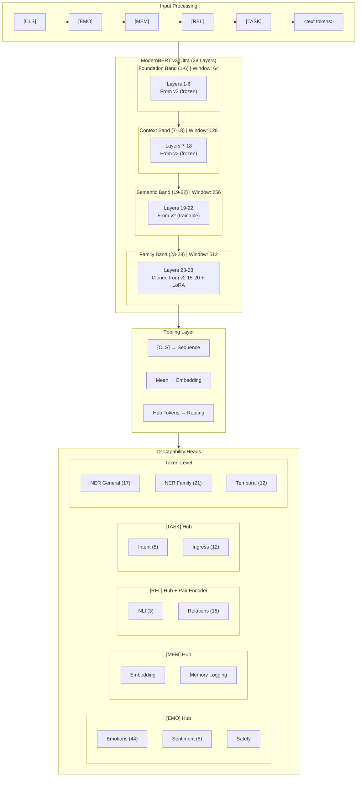

# ModernBERT v3 Ultra — Enhanced Multi-Task Architecture

**Version:** 3.3 (Final Spec)
**Date:** December 2025
**Codename:** Ultra
**Status:** Production-Ready Specification
**Strategy:** Function Preserving Growth (Weight Transfer from v2)

---

## Executive Summary

ModernBERT v3 Ultra is a **28-layer, 768-dimension** encoder architecture designed for FamilyOS multi-task inference. It introduces:

1. **Hub Tokens** — 4 specialized tokens (`[EMO]`, `[MEM]`, `[REL]`, `[TASK]`) with **Global Bidirectional Attention**
2. **Multi-Scale Attention** — Flash Attention with sliding windows (64→128→256→512) + **Global Hub Tokens**
3. **Family Encoder Band** — Layers 23–28 (cloned from v2 layers 15–20) with LoRA adapters
4. **Function Preserving Growth** — Direct weight transfer from v2 (no distillation needed)
5. **Pair Encoder** — Cross-attention block for NLI and Relation extraction
6. **Semantic Hub Initialization** — Hub tokens initialized as centroids of related word embeddings
7. **Phase 0.5 Healing** — Layer interface alignment before multi-task training

**Target:** Edge-deployable (~200M params, <35ms/256 tokens on NPU)

> ⚠️ **v3.3 Critical Fixes:** This version addresses three architectural issues identified in expert review:
>
> 1. **Blind Hub Problem** → Global Bidirectional Attention for hub tokens
> 2. **Transplant Rejection** → Phase 0.5 Healing warmup
> 3. **Random Initialization Waste** → Semantic centroid initialization for hub tokens

---

## Training Philosophy: Function Preserving Growth

> **v3 inherits v2 weights directly via Function Preserving Growth.**
> **No distillation needed — we copy and clone transformer weights.**

**Why this works:**

- Hidden size unchanged: 768 → 768 ✅
- Attention unchanged: 12-head MHA → 12-head MHA ✅
- FFN unchanged: GELU → GELU ✅
- All v2 weight matrices load directly without any projection or reparameterization

**Weight Transfer Strategy:**

- ✅ **Layers 1–22**: Direct copy from v2 layers 1–22
- ✅ **Layers 23–28**: Cloned from v2 layers 15–20 (mature semantic processors)
- ✅ **Tokenizer & Vocabulary**: Reused from v2
- ✅ **Word Embeddings**: Direct copy from v2
- 🆕 **Hub Token Embeddings**: **Semantic Centroid Initialization** (NOT random — see Section 2.5)
- ❌ **Distillation**: NOT needed (weights transfer directly)
- 🆕 **Phase 0.5 Healing**: 2,000 steps on Stage A data to align L22→L23 interface

**Why clone layers 15–20 for 23–28?**

Layers 15–20 are high-level semantic processors in v2. Cloning them to 23–28 gives the new "Family Band" a strong starting point rather than random noise. During Phase 1 training, these cloned layers will diverge and specialize for family-specific reasoning.

---

## 1. Architecture Overview

### 1.1 v2 → v3.3 Comparison

| Aspect | v2 (Current) | v3.3 Ultra (Final) | Notes |
|--------|--------------|---------------------|-------|
| **Layers** | 22 | 28 | +6 via cloning |
| **Hidden Size** | 768 | 768 | Same (weight transfer) |
| **Attention Heads** | 12 (MHA) | 12 (MHA) | Same (no GQA) |
| **Context Length** | 8,192 | 8,192 | Same |
| **Attention Windows** | Global | 64→128→256→512 + **Global Hubs** | v3.3 fix |
| **FFN** | GELU | GELU | Same (no SwiGLU) |
| **Hub Tokens** | None | 4 tokens (semantic init) | v3.3 fix |
| **Hub Attention** | N/A | **Bidirectional Global** | v3.3 fix |
| **Poolers** | CLS + Mean | CLS + Mean + Hub | +Hub routing |
| **Pair Encoder** | None | Cross-attention | NLI/Relation |
| **Adapters** | Task-grouped | LoRA (layers 23-28) | Focused |
| **Training** | Direct | Phase 0.5 Healing + 15% Replay | v3.3 fix |
| **Parameters** | ~149M | ~180M | +21% |
| **Target Latency** | ~50ms | <55ms | Acceptable |

### 1.2 Layer Organization

```text
┌─────────────────────────────────────────────────────────────────┐
│                    ModernBERT v3 Ultra (28 Layers)              │
├─────────────────────────────────────────────────────────────────┤
│                                                                 │
│  ┌─────────────────────────────────────────────────────────┐   │
│  │  INPUT LAYER                                             │   │
│  │  [CLS] [EMO] [MEM] [REL] [TASK] <text tokens...>        │   │
│  │  Hub tokens prepended after CLS                          │   │
│  └─────────────────────────────────────────────────────────┘   │
│                              ↓                                  │
│  ┌─────────────────────────────────────────────────────────┐   │
│  │  FOUNDATION BAND (Layers 1-6)        Window: 64         │   │
│  │  • Copied from v2 layers 1-6 (FROZEN in Phase 1)        │   │
│  │  • Local token interactions                              │   │
│  │  • GELU FFN (MHA, 12 heads)                             │   │
│  └─────────────────────────────────────────────────────────┘   │
│                              ↓                                  │
│  ┌─────────────────────────────────────────────────────────┐   │
│  │  CONTEXT BAND (Layers 7-14)          Window: 128        │   │
│  │  • Copied from v2 layers 7-14 (FROZEN in Phase 1)       │   │
│  │  • Phrase-level understanding                            │   │
│  │  • GELU FFN (MHA, 12 heads)                             │   │
│  └─────────────────────────────────────────────────────────┘   │
│                              ↓                                  │
│  ┌─────────────────────────────────────────────────────────┐   │
│  │  CONTEXT BAND (Layers 15-18)         Window: 128        │   │
│  │  • Copied from v2 layers 15-18 (FROZEN in Phase 1)      │   │
│  │  • Upper phrase-level processing                         │   │
│  │  • GELU FFN (MHA, 12 heads)                             │   │
│  └─────────────────────────────────────────────────────────┘   │
│                              ↓                                  │
│  ┌─────────────────────────────────────────────────────────┐   │
│  │  SEMANTIC BAND (Layers 19-22)        Window: 256        │   │
│  │  • Copied from v2 layers 19-22 (TRAINABLE)              │   │
│  │  • Sentence-level semantics + Hub integration           │   │
│  │  • GELU FFN (MHA, 12 heads)                             │   │
│  └─────────────────────────────────────────────────────────┘   │
│                              ↓                                  │
│  ┌─────────────────────────────────────────────────────────┐   │
│  │  FAMILY BAND (Layers 23-28)          Window: 512        │   │
│  │  • CLONED from v2 layers 15-20 (TRAINABLE)              │   │
│  │  • LoRA adapters attached (r=16, α=16)                  │   │
│  │  • Family-specific representations                       │   │
│  │  • GELU FFN (MHA, 12 heads)                             │   │
│  │  • Hub token specialization                              │   │
│  └─────────────────────────────────────────────────────────┘   │
│                              ↓                                  │
│  ┌─────────────────────────────────────────────────────────┐   │
│  │  POOLER                                                  │   │
│  │  • [CLS] → Sequence classification tasks                │   │
│  │  • Mean Pool → Embedding tasks                          │   │
│  │  • Hub Token Pool → Capability-specific routing         │   │
│  └─────────────────────────────────────────────────────────┘   │
│                              ↓                                  │
│  ┌─────────────────────────────────────────────────────────┐   │
│  │  TASK HEADS (12 Capabilities)                           │   │
│  │  • Emotions, Sentiment, Safety → [EMO] token            │   │
│  │  • Embedding, Memory → [MEM] token                      │   │
│  │  • NLI, Relations → [REL] token + Pair Encoder         │   │
│  │  • Intent, Ingress → [TASK] token                       │   │
│  └─────────────────────────────────────────────────────────┘   │
│                                                                 │
└─────────────────────────────────────────────────────────────────┘
```

### 1.3 Architecture Diagram (Mermaid)



---

## 2. Hub Tokens

### 2.1 Token Definitions

Hub tokens are **special tokens prepended after [CLS]** that serve as capability routers. Each hub token aggregates information relevant to its assigned capabilities during the forward pass.

```python
# src/modeling_studio/models/hub_tokens.py

HUB_TOKENS = {
    "[EMO]": {
        "id": 50265,  # Reserved token ID
        "description": "Emotional/affective state routing",
        "capabilities": ["emotions", "sentiment", "safety_generic", "safety_familyos"],
        "initialization": "semantic_centroid",  # v3.3: Semantic initialization
        "seed_words": ["happy", "sad", "angry", "fear", "joy", "anxious", "love", "feeling"],
        "is_global": True,  # v3.3: Global bidirectional attention
    },
    "[MEM]": {
        "id": 50266,
        "description": "Memory and embedding routing",
        "capabilities": ["embedding"],
        "initialization": "semantic_centroid",
        "seed_words": ["remember", "memory", "past", "history", "recall", "yesterday"],
        "is_global": True,
    },
    "[REL]": {
        "id": 50267,
        "description": "Relational reasoning routing",
        "capabilities": ["nli", "relation"],
        "initialization": "semantic_centroid",
        "seed_words": ["family", "mother", "father", "sister", "brother", "parent", "child"],
        "is_global": True,
    },
    "[TASK]": {
        "id": 50268,
        "description": "Task/intent routing",
        "capabilities": ["intent", "ingress"],
        "initialization": "semantic_centroid",
        "seed_words": ["action", "do", "want", "need", "help", "schedule", "plan"],
        "is_global": True,
    },
}
```

### 2.2 Hub Token Injection

```python
# src/modeling_studio/models/tokenization_v3.py

class HubTokenizer:
    """
    Wraps the base tokenizer to inject hub tokens.

    Input:  "Had dinner with family"
    Output: "[CLS] [EMO] [MEM] [REL] [TASK] Had dinner with family [SEP]"
    """

    HUB_TOKEN_IDS = [50265, 50266, 50267, 50268]  # [EMO], [MEM], [REL], [TASK]

    def __init__(self, base_tokenizer):
        self.tokenizer = base_tokenizer
        # Add hub tokens to vocabulary
        self.tokenizer.add_tokens(["[EMO]", "[MEM]", "[REL]", "[TASK]"])

    def __call__(self, text: str, **kwargs) -> dict:
        # Standard tokenization
        encoded = self.tokenizer(text, **kwargs)

        # Inject hub tokens after [CLS] (position 0)
        input_ids = encoded["input_ids"]
        attention_mask = encoded["attention_mask"]

        # Insert hub tokens at positions 1-4
        new_input_ids = [input_ids[0]] + self.HUB_TOKEN_IDS + input_ids[1:]
        new_attention_mask = [1] * (len(attention_mask) + 4)
        new_attention_mask[0] = attention_mask[0]
        new_attention_mask[5:] = attention_mask[1:]

        return {
            "input_ids": new_input_ids,
            "attention_mask": new_attention_mask,
            "hub_positions": [1, 2, 3, 4],  # [EMO], [MEM], [REL], [TASK]
        }
```

### 2.3 Hub Token Pooling

```python
# src/modeling_studio/models/poolers_v3.py

class HubTokenPooler(nn.Module):
    """
    Extract representations from hub token positions.

    Each hub token's final hidden state is used as the
    representation for its assigned capabilities.
    """

    HUB_POSITIONS = {
        "emo": 1,   # [EMO] at position 1
        "mem": 2,   # [MEM] at position 2
        "rel": 3,   # [REL] at position 3
        "task": 4,  # [TASK] at position 4
    }

    def forward(
        self,
        hidden_states: torch.Tensor,  # (batch, seq_len, hidden)
        hub_name: str,
    ) -> torch.Tensor:
        """Extract hidden state at hub token position."""
        position = self.HUB_POSITIONS[hub_name]
        return hidden_states[:, position, :]  # (batch, hidden)
```

### 2.4 Hub → Capability Mapping

| Hub Token | Position | Capabilities | Rationale |
|-----------|----------|--------------|-----------|
| `[EMO]` | 1 | emotions, sentiment, safety_generic, safety_familyos | Affective understanding |
| `[MEM]` | 2 | embedding | Memory retrieval & storage |
| `[REL]` | 3 | nli, relation | Entity & logical relationships |
| `[TASK]` | 4 | intent, ingress | User action classification |
| `[CLS]` | 0 | (fallback) | General sequence representation |
| Token-level | N/A | ner_general, ner_family, temporal | Per-token classification |

---

### 2.5 Semantic Centroid Initialization (v3.3 Critical Fix)

> **Problem:** Random initialization (`Normal(0, 0.02)`) wastes training steps as the model learns from scratch that `[EMO]` should attend to emotion-related words.
>
> **Solution:** Initialize hub token embeddings as the **centroid of semantically related word embeddings** from v2.

```python
# src/modeling_studio/models/hub_initialization_v3.py

def initialize_hub_tokens_semantic(
    v3_model: ModernBERTv3Ultra,
    v2_tokenizer,
    v2_embeddings: torch.Tensor,
) -> None:
    """
    Initialize hub token embeddings as semantic centroids.

    For each hub token, we:
    1. Tokenize the seed words using v2 tokenizer
    2. Average the subword embeddings for each word
    3. Average across all words to get the centroid
    4. Assign centroid as the hub token's initial embedding

    This places hub tokens in the correct "neighborhood" of the
    embedding space, giving them a semantic head start.
    """

    HUB_SEED_WORDS = {
        "[EMO]": ["happy", "sad", "angry", "fear", "joy", "anxious", "love", "feeling"],
        "[MEM]": ["remember", "memory", "past", "history", "recall", "yesterday"],
        "[REL]": ["family", "mother", "father", "sister", "brother", "parent", "child"],
        "[TASK]": ["action", "do", "want", "need", "help", "schedule", "plan"],
    }

    HUB_TOKEN_IDS = {
        "[EMO]": 50265,
        "[MEM]": 50266,
        "[REL]": 50267,
        "[TASK]": 50268,
    }

    with torch.no_grad():
        for hub_name, seed_words in HUB_SEED_WORDS.items():
            word_embeddings = []

            for word in seed_words:
                # Tokenize word (may produce subwords)
                token_ids = v2_tokenizer.encode(word, add_special_tokens=False)

                # Average subword embeddings for this word
                subword_embeds = v2_embeddings[token_ids]  # (num_subwords, 768)
                word_embed = subword_embeds.mean(dim=0)    # (768,)
                word_embeddings.append(word_embed)

            # Stack and compute centroid
            word_embeddings = torch.stack(word_embeddings)  # (num_words, 768)
            centroid = word_embeddings.mean(dim=0)          # (768,)

            # Assign to hub token
            hub_idx = HUB_TOKEN_IDS[hub_name]
            v3_model.embeddings.word_embeddings.weight[hub_idx] = centroid

            print(f"{hub_name}: Initialized as centroid of {len(seed_words)} seed words")

    print("\n✓ Hub tokens initialized with semantic centroids")
```

**Why This Matters:**

- `[EMO]` starts near "happy", "sad", "angry" in vector space
- `[REL]` starts near "family", "mother", "father" in vector space
- Model immediately knows these tokens are relevant to their domains
- Saves ~500-1000 training steps of random walk

---

## 3. Multi-Scale Attention

### 3.1 Global Attention for Hub Tokens (v3.3 Critical Fix)

> **Problem ("Blind Hub"):** With sliding windows, hub tokens at positions 1-4 can only see nearby tokens. If `[EMO]` is at position 1 with a 512-token window, and the input is 1000 tokens, `[EMO]` cannot "see" tokens 513-1000. This renders hub tokens useless for summarizing long family stories.
>
> **Solution:** Hub tokens use **Bidirectional Global Attention** (à la BigBird/Longformer):
>
> - Hub tokens (positions 1-4) attend to **ALL** tokens in the sequence
> - **ALL** tokens attend to hub tokens
> - Regular text tokens use sliding windows as normal

```python
# src/modeling_studio/models/attention_v3.py

# Global token positions (exempt from sliding window)
GLOBAL_TOKEN_POSITIONS = [0, 1, 2, 3, 4]  # [CLS], [EMO], [MEM], [REL], [TASK]

def create_global_local_attention_mask(
    seq_len: int,
    window_size: int,
    global_positions: list = GLOBAL_TOKEN_POSITIONS,
    device: torch.device = None,
) -> torch.Tensor:
    """
    Create attention mask with global tokens + sliding windows.

    Global tokens (positions 0-4):
      - Can attend to ALL tokens (row is all 1s)
      - Are attended by ALL tokens (column is all 1s)

    Regular tokens (positions 5+):
      - Attend within sliding window + global tokens

    Returns:
        attention_mask: (seq_len, seq_len) boolean mask
        True = can attend, False = masked
    """
    # Start with sliding window mask
    mask = torch.zeros(seq_len, seq_len, dtype=torch.bool, device=device)

    # Fill sliding windows for all positions
    for i in range(seq_len):
        start = max(0, i - window_size // 2)
        end = min(seq_len, i + window_size // 2 + 1)
        mask[i, start:end] = True

    # Global tokens: can attend to everything (rows)
    for pos in global_positions:
        if pos < seq_len:
            mask[pos, :] = True  # Global token sees all

    # Global tokens: are attended by everything (columns)
    for pos in global_positions:
        if pos < seq_len:
            mask[:, pos] = True  # All tokens see global token

    return mask


# Visual example (seq_len=10, window=4, globals=[0,1,2,3,4]):
#
#           0  1  2  3  4  5  6  7  8  9   (keys)
#        +--------------------------------
#    0   |  1  1  1  1  1  1  1  1  1  1   <- [CLS] global
#    1   |  1  1  1  1  1  1  1  1  1  1   <- [EMO] global
#    2   |  1  1  1  1  1  1  1  1  1  1   <- [MEM] global
#    3   |  1  1  1  1  1  1  1  1  1  1   <- [REL] global
#    4   |  1  1  1  1  1  1  1  1  1  1   <- [TASK] global
#    5   |  1  1  1  1  1  1  1  1  0  0   <- text: globals + window
#    6   |  1  1  1  1  1  0  1  1  1  0   <- text: globals + window
#    7   |  1  1  1  1  1  0  0  1  1  1   <- text: globals + window
#    8   |  1  1  1  1  1  0  0  0  1  1   <- text: globals + window
#    9   |  1  1  1  1  1  0  0  0  0  1   <- text: globals + window
# (queries)
#
# Key insight: Every row has 1s in columns 0-4 (globals visible)
#              Columns 0-4 have 1s in every row (globals attend everywhere)
```

**Why Bidirectional?**

- Hub tokens are not just "listeners"; they are "broadcasters"
- Every text token can condition its representation on hub tokens
- Hub tokens can summarize the entire sequence regardless of length
- Cost: Negligible (~4 × seq_len additional attention, tiny vs N²)

---

### 3.2 Sliding Window Configuration

v3 uses **Flash Attention 2** with layer-wise sliding windows. Smaller windows in early layers capture local patterns; larger windows in later layers capture global context.

```python
# src/modeling_studio/models/attention_v3.py

LAYER_WINDOW_CONFIG = {
    # Foundation Band: Local token interactions
    1: 64, 2: 64, 3: 64, 4: 64, 5: 64, 6: 64,

    # Context Band: Phrase-level patterns
    7: 128, 8: 128, 9: 128, 10: 128, 11: 128, 12: 128, 13: 128, 14: 128,
    15: 128, 16: 128, 17: 128, 18: 128,

    # Semantic Band: Sentence-level semantics
    19: 256, 20: 256, 21: 256, 22: 256,

    # Family Band: Full context for family understanding
    23: 512, 24: 512, 25: 512, 26: 512, 27: 512, 28: 512,
}

def get_window_size(layer_idx: int) -> int:
    """Get sliding window size for a given layer."""
    return LAYER_WINDOW_CONFIG.get(layer_idx, 512)
```

### 3.3 Attention Implementation with Global Tokens (Phase 1: MHA)

```python
# src/modeling_studio/models/attention_v3.py

from flash_attn import flash_attn_func
from flash_attn.bert_padding import pad_input, unpad_input

class MultiScaleAttentionWithGlobals(nn.Module):
    """
    Multi-Head Attention with sliding windows + global hub tokens (v3.3).

    v3.3 Features:
    - Sliding windows for text tokens (64/128/256/512 by layer)
    - Global bidirectional attention for hub tokens (positions 1-4)
    - [CLS] at position 0 also treated as global

    Phase 1 Config (matches v2 for weight loading):
    - Heads: 12 (standard MHA)
    - Window size: layer-dependent (64/128/256/512)
    """

    GLOBAL_POSITIONS = [0, 1, 2, 3, 4]  # [CLS], [EMO], [MEM], [REL], [TASK]

    def __init__(
        self,
        hidden_size: int = 768,
        num_heads: int = 12,
        layer_idx: int = 1,
    ):
        super().__init__()
        self.hidden_size = hidden_size
        self.num_heads = num_heads
        self.head_dim = hidden_size // num_heads  # 768 / 12 = 64
        self.window_size = get_window_size(layer_idx)

        # Standard MHA projections (same as v2 for weight loading)
        self.q_proj = nn.Linear(hidden_size, hidden_size)
        self.k_proj = nn.Linear(hidden_size, hidden_size)
        self.v_proj = nn.Linear(hidden_size, hidden_size)
        self.o_proj = nn.Linear(hidden_size, hidden_size)

    def forward(
        self,
        hidden_states: torch.Tensor,
        attention_mask: torch.Tensor = None,
    ) -> torch.Tensor:
        batch_size, seq_len, _ = hidden_states.shape

        # Compute Q, K, V
        q = self.q_proj(hidden_states).view(batch_size, seq_len, self.num_heads, self.head_dim)
        k = self.k_proj(hidden_states).view(batch_size, seq_len, self.num_heads, self.head_dim)
        v = self.v_proj(hidden_states).view(batch_size, seq_len, self.num_heads, self.head_dim)

        # Create global+local attention mask
        global_local_mask = create_global_local_attention_mask(
            seq_len=seq_len,
            window_size=self.window_size,
            global_positions=self.GLOBAL_POSITIONS,
            device=hidden_states.device,
        )

        # Combine with padding mask if provided
        if attention_mask is not None:
            # attention_mask: (batch, seq_len) -> expand to (batch, 1, seq_len, seq_len)
            padding_mask = attention_mask.unsqueeze(1).unsqueeze(2)
            combined_mask = global_local_mask.unsqueeze(0) & padding_mask.bool()
        else:
            combined_mask = global_local_mask.unsqueeze(0).expand(batch_size, -1, -1)

        # Flash Attention with custom mask
        # Note: For production, use flash_attn's native global token support
        attn_output = flash_attn_func(
            q, k, v,
            window_size=(self.window_size // 2, self.window_size // 2),
            causal=False,  # Encoder, not causal
        )
        # TODO: Integrate global token mask with Flash Attention 2's
        #       native support via `key_padding_mask` or custom kernel

        # Reshape and project
        attn_output = attn_output.view(batch_size, seq_len, self.hidden_size)
        return self.o_proj(attn_output)
```

### 3.4 Window Size Rationale

| Band | Layers | Window | Purpose |
|------|--------|--------|---------|
| Foundation | 1-6 | 64 | Token-level patterns (morphology, subwords) |
| Context | 7-18 | 128 | Phrase patterns (entities, short phrases) |
| Semantic | 19-22 | 256 | Clause/sentence patterns (syntax, semantics) |
| Family | 23-28 | 512 | Full context (family dynamics, relationships) |

---

## 4. Transformer Block (Phase 1: v2-Compatible)

### 4.1 FFN (Phase 1: GELU)

Phase 1 uses **GELU FFN** to match v2 weights exactly. SwiGLU is a Phase 2 upgrade.

```python
# src/modeling_studio/models/ffn_v3.py

class GELUFFN(nn.Module):
    """
    Standard GELU Feed-Forward Network (matches v2 for weight loading).

    Phase 1: GELU (v2-compatible)
    Phase 2: Upgrade to SwiGLU via weight approximation
    """

    def __init__(
        self,
        hidden_size: int = 768,
        intermediate_size: int = 3072,  # 768 * 4 (standard)
        dropout: float = 0.1,
    ):
        super().__init__()
        self.dense_in = nn.Linear(hidden_size, intermediate_size)
        self.dense_out = nn.Linear(intermediate_size, hidden_size)
        self.activation = nn.GELU()
        self.dropout = nn.Dropout(dropout)

    def forward(self, x: torch.Tensor) -> torch.Tensor:
        x = self.dense_in(x)
        x = self.activation(x)
        x = self.dropout(x)
        x = self.dense_out(x)
        return x
```

### 4.2 GQA/SwiGLU — Moved to R&D (v3.3 Decision)

> **v3.3 Decision:** GQA and SwiGLU are **removed from production roadmap** and moved to separate R&D experimentation.
>
> **Rationale:** Reparameterizing GELU to SwiGLU without destroying the model is mathematically messy and rarely works well without massive retraining. If Phase 1 (MHA/GELU) hits the <35ms latency target on NPU (which it likely will with Flash Attention), there is **zero business value** in risking stability for marginal theoretical gains.

```text
┌─────────────────────────────────────────────────────────────────┐
│  GQA/SwiGLU STATUS: EXPERIMENTAL R&D ONLY                       │
├─────────────────────────────────────────────────────────────────┤
│                                                                 │
│  ❌ NOT in v3 production roadmap                                │
│  ❌ NOT a promised upgrade                                      │
│  ❌ Do NOT block v3 shipping for this                           │
│                                                                 │
│  ✅ May be explored in separate "v4 Research" track            │
│  ✅ Document learnings for future architectures                 │
│  ✅ If Phase 1 meets latency targets, skip entirely             │
│                                                                 │
└─────────────────────────────────────────────────────────────────┘
```

**Previous Phase 2 Plan (DEPRECATED):**
```python
# DEPRECATED - Do not implement
# GQA Upgrade: Convert 12-head MHA to 16Q/4KV GQA
# SwiGLU Upgrade: Convert GELU FFN to SwiGLU
# Risk: Stability issues, potential quality regression
```

### 4.3 Complete Transformer Layer (Phase 1)

```python
# src/modeling_studio/models/layers_v3.py

class ModernBERTLayerV3(nn.Module):
    """
    v3 Transformer layer (Phase 1: v2-compatible).

    Phase 1 features:
    - Multi-Head Attention (12 heads, matches v2)
    - Multi-scale sliding windows (64/128/256/512)
    - GELU FFN (matches v2)
    - LayerNorm (matches v2)
    - Optional LoRA adapters (layers 23-28)
    """

    def __init__(
        self,
        hidden_size: int = 768,
        layer_idx: int = 1,
        use_lora: bool = False,
        lora_r: int = 16,
        lora_alpha: int = 16,
        lora_dropout: float = 0.05,
    ):
        super().__init__()
        self.layer_idx = layer_idx

        # LayerNorm (matches v2)
        self.input_layernorm = nn.LayerNorm(hidden_size)
        self.post_attention_layernorm = nn.LayerNorm(hidden_size)

        # Attention (MHA with sliding window)
        self.attention = MultiScaleAttention(
            hidden_size=hidden_size,
            num_heads=12,  # Standard MHA (matches v2)
            layer_idx=layer_idx,
        )

        # FFN (GELU, matches v2)
        self.ffn = GELUFFN(
            hidden_size=hidden_size,
            intermediate_size=hidden_size * 4,  # 768 * 4 = 3072
        )

        # LoRA (only for layers 23-28 = Family Band)
        self.use_lora = use_lora and layer_idx >= 23
        if self.use_lora:
            self.lora_q = LoRALayer(hidden_size, lora_r, lora_alpha, lora_dropout)
            self.lora_v = LoRALayer(hidden_size, lora_r, lora_alpha, lora_dropout)

    def forward(
        self,
        hidden_states: torch.Tensor,
        attention_mask: torch.Tensor = None,
    ) -> torch.Tensor:
        # Pre-norm attention
        residual = hidden_states
        hidden_states = self.input_layernorm(hidden_states)
        hidden_states = self.attention(hidden_states, attention_mask)

        # Add LoRA if enabled
        if self.use_lora:
            hidden_states = hidden_states + self.lora_q(residual) + self.lora_v(residual)

        hidden_states = residual + hidden_states

        # Pre-norm FFN
        residual = hidden_states
        hidden_states = self.post_attention_layernorm(hidden_states)
        hidden_states = self.ffn(hidden_states)
        hidden_states = residual + hidden_states

        return hidden_states
```

---

## 5. LoRA Adapters

### 5.1 Configuration

LoRA adapters are attached to **layers 23-28** (Family Band) for capability-specific fine-tuning.

```yaml
# configs/training/multitask/stage_v3.yaml

lora:
  enabled: true
  target_layers: [23, 24, 25, 26, 27, 28]  # Family Band (cloned layers)
  target_modules: ["q_proj", "v_proj"]  # Q and V attention projections
  r: 16                            # Rank
  alpha: 16                        # Scaling factor (alpha/r = 1)
  dropout: 0.05                    # LoRA dropout
  bias: "none"                     # No bias training

  # Per-capability LoRA (optional, for future)
  capability_specific: false       # All capabilities share same LoRA for now
```

### 5.2 LoRA Implementation

```python
# src/modeling_studio/models/lora_v3.py

class LoRALayer(nn.Module):
    """
    Low-Rank Adaptation layer.

    W' = W + BA where:
    - W: frozen pretrained weights
    - B: (hidden_size, r) learned
    - A: (r, hidden_size) learned
    - Scaling: alpha / r
    """

    def __init__(
        self,
        hidden_size: int,
        r: int = 16,
        alpha: int = 16,
        dropout: float = 0.05,
    ):
        super().__init__()
        self.r = r
        self.scaling = alpha / r

        # LoRA matrices
        self.lora_A = nn.Linear(hidden_size, r, bias=False)
        self.lora_B = nn.Linear(r, hidden_size, bias=False)
        self.lora_dropout = nn.Dropout(dropout)

        # Initialize A with Kaiming, B with zeros
        nn.init.kaiming_uniform_(self.lora_A.weight, a=math.sqrt(5))
        nn.init.zeros_(self.lora_B.weight)

    def forward(self, x: torch.Tensor) -> torch.Tensor:
        """Compute LoRA delta: scaling * B(A(dropout(x)))"""
        return self.scaling * self.lora_B(self.lora_A(self.lora_dropout(x)))
```

### 5.3 Why Layers 23-28?

| Layer Range | Source | Training Mode | Rationale |
|-------------|--------|---------------|-----------|
| 1-6 (Foundation) | v2 layers 1-6 | Frozen | Core token representations, well-pretrained |
| 7-18 (Context) | v2 layers 7-18 | Frozen | Phrase patterns, transfer well |
| 19-22 (Semantic) | v2 layers 19-22 | Trainable | Buffer to integrate Hub tokens |
| 23-28 (Family) | Cloned from v2 15-20 | Trainable + LoRA | New capacity for FamilyOS-specific logic |

---

## 6. Pair Encoder

### 6.1 Purpose

The Pair Encoder handles tasks requiring **reasoning over entity pairs**:

- **NLI**: Premise-hypothesis entailment
- **Relation Extraction**: Subject-object relationships

### 6.2 Architecture

```python
# src/modeling_studio/models/pair_encoder_v3.py

class PairEncoder(nn.Module):
    """
    Cross-encoder for pair-based reasoning.

    Unlike bi-encoders that encode separately, cross-encoders
    allow full attention between both sequences for richer interaction.

    For NLI: (premise, hypothesis) → entailment/neutral/contradiction
    For Relations: (subject_span, object_span) → relation_type
    """

    def __init__(
        self,
        hidden_size: int = 768,  # Same as v2
        num_heads: int = 8,
        dropout: float = 0.1,
    ):
        super().__init__()

        # Cross-attention: sequence attends to spans
        self.cross_attention = nn.MultiheadAttention(
            embed_dim=hidden_size,
            num_heads=num_heads,
            dropout=dropout,
            batch_first=True,
        )

        # Span extraction projections
        self.span_proj = nn.Linear(hidden_size, hidden_size)

        # Fusion layer
        self.fusion = nn.Sequential(
            nn.Linear(hidden_size * 3, hidden_size),  # [REL] + span_a + span_b
            nn.GELU(),
            nn.Dropout(dropout),
            nn.Linear(hidden_size, hidden_size),
        )

        self.layer_norm = nn.LayerNorm(hidden_size)

    def forward(
        self,
        hidden_states: torch.Tensor,      # (batch, seq_len, hidden)
        span_a_mask: torch.Tensor,         # (batch, seq_len) - first entity/premise
        span_b_mask: torch.Tensor,         # (batch, seq_len) - second entity/hypothesis
        rel_token_position: int = 3,       # [REL] token position
    ) -> torch.Tensor:
        """
        Returns pair representation for classification.
        """
        batch_size = hidden_states.size(0)

        # Extract [REL] token representation
        rel_repr = hidden_states[:, rel_token_position, :]  # (batch, hidden)

        # Extract span representations (mean pool over span tokens)
        span_a_repr = self._extract_span(hidden_states, span_a_mask)
        span_b_repr = self._extract_span(hidden_states, span_b_mask)

        # Cross-attention: rel_repr attends to both spans
        spans_combined = torch.stack([span_a_repr, span_b_repr], dim=1)  # (batch, 2, hidden)
        cross_out, _ = self.cross_attention(
            query=rel_repr.unsqueeze(1),   # (batch, 1, hidden)
            key=spans_combined,
            value=spans_combined,
        )
        cross_out = cross_out.squeeze(1)  # (batch, hidden)

        # Fusion: combine all representations
        combined = torch.cat([rel_repr, span_a_repr, span_b_repr], dim=-1)
        fused = self.fusion(combined)

        # Residual + norm
        output = self.layer_norm(cross_out + fused)

        return output

    def _extract_span(
        self,
        hidden_states: torch.Tensor,
        span_mask: torch.Tensor,
    ) -> torch.Tensor:
        """Mean pool over span tokens."""
        span_mask = span_mask.unsqueeze(-1).float()
        span_sum = (hidden_states * span_mask).sum(dim=1)
        span_len = span_mask.sum(dim=1).clamp(min=1)
        return self.span_proj(span_sum / span_len)
```

### 6.3 Usage Examples

```python
# NLI Example
premise = "The cat sat on the mat"
hypothesis = "An animal is on the floor"
# Tokenized: [CLS] [EMO] [MEM] [REL] [TASK] <premise> [SEP] <hypothesis> [SEP]
# span_a_mask: marks premise tokens
# span_b_mask: marks hypothesis tokens
# Output: entailment

# Relation Example
text = "Mom took Panda to the park"
# Tokenized: [CLS] [EMO] [MEM] [REL] [TASK] Mom took Panda to the park [SEP]
# span_a_mask: marks "Mom"
# span_b_mask: marks "Panda"
# Output: parent_of
```

---

## 7. Complete Model Architecture

### 7.1 Model Definition

```python
# src/modeling_studio/models/modernbert_v3.py

class ModernBERTv3Ultra(nn.Module):
    """
    ModernBERT v3 Ultra: 28-layer, 768-dim multi-task encoder.

    Phase 1 Features (Pragmatic Option B):
    - Hub tokens for capability routing ([EMO], [MEM], [REL], [TASK])
    - Multi-scale sliding window attention (64→128→256→512)
    - Standard MHA (12 heads) - Phase 2: upgrade to GQA
    - GELU FFN - Phase 2: upgrade to SwiGLU
    - LoRA adapters on layers 23-28
    - Pair encoder for NLI/Relation
    - 12 capability heads
    - Direct weight transfer from v2 (Function Preserving Growth)
    """

    def __init__(self, config: ModernBERTv3Config):
        super().__init__()
        self.config = config

        # Embeddings (includes hub tokens)
        self.embeddings = ModernBERTv3Embeddings(config)

        # Encoder layers (28 total)
        self.layers = nn.ModuleList([
            ModernBERTLayerV3(
                hidden_size=config.hidden_size,
                layer_idx=i + 1,
                use_lora=(i + 1) >= 25,  # LoRA for layers 25-28
                lora_r=config.lora_r,
                lora_alpha=config.lora_alpha,
            )
            for i in range(config.num_hidden_layers)
        ])

        # Poolers
        self.cls_pooler = CLSPooler(config.hidden_size)
        self.mean_pooler = MeanPooler()
        self.hub_pooler = HubTokenPooler()

        # Pair encoder (for NLI, Relation)
        self.pair_encoder = PairEncoder(
            hidden_size=config.hidden_size,
            num_heads=8,
        )

        # Capability heads
        self.heads = nn.ModuleDict({
            # [EMO] Hub
            "emotions": EmotionHead(config.hidden_size, num_labels=44),
            "sentiment": SentimentHead(config.hidden_size, num_labels=5),
            "safety_generic": SafetyHead(config.hidden_size, num_labels=8),
            "safety_familyos": HierarchicalSafetyHead(config.hidden_size),

            # [MEM] Hub
            "embedding": EmbeddingHead(config.hidden_size, output_dim=768),

            # [REL] Hub (uses pair encoder)
            "nli": NLIHead(config.hidden_size, num_labels=3),
            "relation": RelationHead(config.hidden_size, num_labels=15),

            # [TASK] Hub
            "intent": IntentHead(config.hidden_size, num_labels=8),
            "ingress": IngressHead(config.hidden_size, num_labels=12),

            # Token-level (use full sequence)
            "ner_general": NERHead(config.hidden_size, num_labels=17),
            "ner_family": NERHead(config.hidden_size, num_labels=21),
            "temporal": TemporalHead(config.hidden_size, num_labels=12),
        })

    def forward(
        self,
        input_ids: torch.Tensor,
        attention_mask: torch.Tensor,
        task: str = None,
        span_a_mask: torch.Tensor = None,  # For pair tasks
        span_b_mask: torch.Tensor = None,
        **kwargs,
    ) -> dict:
        # Embeddings
        hidden_states = self.embeddings(input_ids)

        # Encoder forward
        for layer in self.layers:
            hidden_states = layer(hidden_states, attention_mask)

        # Get representations based on task
        outputs = {"hidden_states": hidden_states}

        if task is None:
            return outputs

        # Route to appropriate pooler based on task
        if task in ["emotions", "sentiment", "safety_generic", "safety_familyos"]:
            repr = self.hub_pooler(hidden_states, "emo")
        elif task == "embedding":
            repr = self.mean_pooler(hidden_states, attention_mask)
        elif task in ["nli", "relation"]:
            repr = self.pair_encoder(hidden_states, span_a_mask, span_b_mask)
        elif task in ["intent", "ingress"]:
            repr = self.hub_pooler(hidden_states, "task")
        else:
            # Token-level tasks
            repr = hidden_states

        # Head forward
        outputs["logits"] = self.heads[task](repr)

        return outputs
```

### 7.2 Configuration

```python
# src/modeling_studio/models/config_v3.py

@dataclass
class ModernBERTv3Config:
    """Configuration for ModernBERT v3.3 Ultra (Final Spec)."""

    # Model architecture (SAME as v2 to allow direct weight loading)
    hidden_size: int = 768             # Same as v2 (NOT 896)
    num_hidden_layers: int = 28        # Extended from v2's 22
    num_attention_heads: int = 12      # Same as v2, MHA (final - no GQA)
    intermediate_size: int = 3072      # 768 * 4 (GELU standard)
    max_position_embeddings: int = 8192
    vocab_size: int = 50269            # Base + 4 hub tokens

    # Attention (v3.3: MHA with sliding windows + global hub tokens)
    attention_type: str = "flash_attention_2"
    window_sizes: list = field(default_factory=lambda: [64, 128, 256, 512])
    global_token_positions: list = field(default_factory=lambda: [0, 1, 2, 3, 4])  # v3.3

    # FFN (Final: GELU standard - no SwiGLU upgrade)
    ffn_type: str = "gelu"
    ffn_expansion: int = 4             # Standard 4x expansion

    # LoRA (applied to new/cloned layers 23-28)
    lora_r: int = 16
    lora_alpha: int = 16
    lora_dropout: float = 0.05
    lora_layers: list = field(default_factory=lambda: [23, 24, 25, 26, 27, 28])

    # Hub tokens (v3.3: semantic centroid initialization)
    hub_tokens: list = field(default_factory=lambda: ["[EMO]", "[MEM]", "[REL]", "[TASK]"])
    hub_token_init: str = "semantic_centroid"  # v3.3: NOT random
    hub_seed_words: dict = field(default_factory=lambda: {
        "[EMO]": ["happy", "sad", "angry", "fear", "joy", "anxious", "love", "feeling"],
        "[MEM]": ["remember", "memory", "past", "history", "recall", "yesterday"],
        "[REL]": ["family", "mother", "father", "sister", "brother", "parent", "child"],
        "[TASK]": ["action", "do", "want", "need", "help", "schedule", "plan"],
    })

    # Layer composition
    layer_source: dict = field(default_factory=lambda: {
        "1-22": "copy_from_v2",        # Direct weight loading
        "23-28": "clone_from_v2_15-20" # Function preserving growth
    })

    # Capabilities
    capabilities: list = field(default_factory=lambda: [
        "emotions", "sentiment", "safety_generic", "safety_familyos",
        "embedding", "nli", "relation", "intent", "ingress",
        "ner_general", "ner_family", "temporal",
    ])
```

---

## 8. Training Strategy (Function Preserving Growth)

### 8.1 Weight Loading from v2 (v3.3 Updated)

```python
# src/modeling_studio/models/initialization_v3.py

def build_v3_from_v2(v2_checkpoint_path: str, v2_tokenizer) -> ModernBERTv3Ultra:
    """
    Create v3 model using Function Preserving Growth from v2.

    v3.3 Updates:
      - Hub tokens use SEMANTIC CENTROID initialization (not random)
      - Requires v2_tokenizer for computing seed word embeddings

    Layer Composition:
      - Layers 1-22: Direct copy from v2
      - Layers 23-28: Cloned from v2 layers 15-20 (valid semantic processors)
      - Hub tokens: Semantic centroid initialization
      - Task heads: New random initialization
    """

    # Load v2 model
    v2 = ModernBERTv2.from_pretrained(v2_checkpoint_path)
    config = ModernBERTv3Config()

    # Create empty v3 model
    v3 = ModernBERTv3Ultra(config)

    with torch.no_grad():
        # 1. Copy embeddings (768-dim matches exactly)
        v3.embeddings.word_embeddings.weight[:50265] = \
            v2.embeddings.word_embeddings.weight.clone()

        # 2. v3.3: Semantic centroid init for hub tokens (NOT random!)
        initialize_hub_tokens_semantic(
            v3_model=v3,
            v2_tokenizer=v2_tokenizer,
            v2_embeddings=v2.embeddings.word_embeddings.weight,
        )

        # 3. Copy layers 1-22 directly
        for i in range(22):
            v3.encoder.layers[i].load_state_dict(
                v2.encoder.layers[i].state_dict()
            )
            print(f"Layer {i+1}: Copied from v2 layer {i+1}")

        # 4. Clone layers 23-28 from v2 layers 15-20
        source_layers = [14, 15, 16, 17, 18, 19]  # 0-indexed: v2 layers 15-20
        for i, src in enumerate(source_layers):
            v3.encoder.layers[22 + i].load_state_dict(
                v2.encoder.layers[src].state_dict()
            )
            print(f"Layer {23 + i}: Cloned from v2 layer {src + 1}")

        # 5. Copy pooler if exists
        if hasattr(v2, 'pooler') and hasattr(v3, 'pooler'):
            v3.pooler.load_state_dict(v2.pooler.state_dict())

    print("\n✓ v3.3 initialized from v2 via Function Preserving Growth")
    print(f"  - Layers 1-22: Copied from v2")
    print(f"  - Layers 23-28: Cloned from v2 layers 15-20")
    print(f"  - Hub tokens: Semantic centroid initialization")

    return v3


def verify_function_preserving(v2, v3, sample_inputs):
    """Verify v3 produces same outputs as v2 for first 22 layers."""
    with torch.no_grad():
        v2_hidden = v2.encoder(sample_inputs, output_hidden_states=True)
        v3_hidden = v3.encoder(sample_inputs, output_hidden_states=True)

        for i in range(22):
            diff = (v2_hidden[i] - v3_hidden[i]).abs().max().item()
            assert diff < 1e-5, f"Layer {i+1} mismatch: {diff}"
            print(f"Layer {i+1}: ✓ Match (max diff: {diff:.2e})")

    print("\n✓ Function Preserving verification passed!")
```

### 8.2 Layer Freezing Strategy

```python
# src/modeling_studio/trainers/v3_trainer.py

def configure_trainable_layers(model: ModernBERTv3Ultra, phase: int):
    """
    Configure which layers are trainable based on training phase.

    Phase 1 Strategy:
      - Freeze layers 1-18 (core v2 knowledge)
      - Train layers 19-28 (upper semantic + new cloned)
      - Train hub tokens (new capability anchors)
      - Train all task heads (new random init)
    """

    # First, freeze everything
    for param in model.parameters():
        param.requires_grad = False

    if phase == 1:
        # Unfreeze layers 19-28
        for i in range(18, 28):  # 0-indexed: layers 19-28
            for param in model.encoder.layers[i].parameters():
                param.requires_grad = True
            print(f"Layer {i+1}: 🔥 Trainable")

        # Unfreeze hub token embeddings (indices 50265-50268)
        model.embeddings.word_embeddings.weight.requires_grad = True
        # Note: We'll mask gradients for non-hub tokens in training loop

        # Unfreeze all task heads
        for head in model.heads.values():
            for param in head.parameters():
                param.requires_grad = True

        # Unfreeze pair encoder
        if hasattr(model, 'pair_encoder'):
            for param in model.pair_encoder.parameters():
                param.requires_grad = True

        print(f"\nPhase 1 Configuration:")
        print(f"  ❄️ Frozen: Layers 1-18")
        print(f"  🔥 Trainable: Layers 19-28")
        print(f"  🔥 Trainable: Hub tokens [EMO], [MEM], [REL], [TASK]")
        print(f"  🔥 Trainable: All task heads")
        print(f"  🔥 Trainable: Pair encoder")


def apply_lora_to_model(model: ModernBERTv3Ultra):
    """Apply LoRA adapters to layers 23-28 (the cloned layers)."""

    lora_config = {
        "r": 16,
        "alpha": 16,
        "dropout": 0.05,
        "target_modules": ["q_proj", "k_proj", "v_proj", "o_proj", "ffn.fc1", "ffn.fc2"],
    }

    for i in range(22, 28):  # 0-indexed: layers 23-28
        layer = model.encoder.layers[i]

        # Apply LoRA to attention projections
        layer.attention.q_proj = LoRALinear(
            layer.attention.q_proj, r=16, alpha=16, dropout=0.05
        )
        layer.attention.k_proj = LoRALinear(
            layer.attention.k_proj, r=16, alpha=16, dropout=0.05
        )
        layer.attention.v_proj = LoRALinear(
            layer.attention.v_proj, r=16, alpha=16, dropout=0.05
        )
        layer.attention.o_proj = LoRALinear(
            layer.attention.o_proj, r=16, alpha=16, dropout=0.05
        )

        print(f"Layer {i+1}: LoRA applied (r=16, α=16)")

    print(f"\n✓ LoRA applied to layers 23-28")
```

### 8.3 Phase Overview (v3.3 Updated)

```yaml
# v3.3 Training Phases (Function Preserving Growth + Critical Fixes)

Phase 0 – Model Initialization:
  action: Build 28-layer v3 from v2 checkpoint
  layers_1_22: Direct copy from v2 (unchanged)
  layers_23_28: Clone from v2 layers 15-20
  embeddings:
    - vocab_tokens: Copy from v2 (768-dim, no projection needed)
    - hub_tokens: SEMANTIC CENTROID initialization (v3.3 fix)
                  [EMO] = mean(happy, sad, angry, fear, joy, anxious, love, feeling)
                  [MEM] = mean(remember, memory, past, history, recall, yesterday)
                  [REL] = mean(family, mother, father, sister, brother, parent, child)
                  [TASK] = mean(action, do, want, need, help, schedule, plan)
  task_heads: New random initialization
  attention_config: Enable GLOBAL ATTENTION for positions 0-4 (v3.3 fix)
  verification: Run sanity check to ensure layers 1-22 produce identical outputs
  output: modernbert-v3-initialized

Phase 0.5 – Enhanced Healing Warmup (v3.3 Ultra CRITICAL):
  description: |
    Align Layer 22 output → Layer 23 input interface using STRUCTURAL HEALING.
    Layer 23 (cloned from L15) expects L14-style features, but receives
    L22-style features which are "rotated" by 8 extra layers of processing.
    This causes "transplant rejection" if not addressed.

    ENHANCED: Uses 5-task structural healing instead of 3-task to prevent
    overfitting to classification logic and ensure context understanding.

  # Enhanced Data Mix (5 tasks instead of 3)
  data_source:
    sst2: 3000       # Sentiment - classification grounding
    conll: 3000      # NER - structural/syntax understanding
    mnli: 2000       # NLI - logic and reasoning
    squad: 2000      # QA - context understanding (heals attention mechanism)
    stsb: 2000       # Similarity - embedding stability (prevents collapse)
    total: 12000     # ~2,500 steps at batch_size=5

  duration: 2,500 steps (increased for richer data)

  # Zipper Learning Rate Strategy (differential by layer position)
  learning_rate:
    layers_19_22: 1e-5    # Semantic: gentle nudge to match L23 expectations
    layer_23: 5e-5        # Interface: MAXIMUM plasticity (fix the scar!)
    layers_24_28: 3e-5    # Clones: moderate adaptation to new signals

  # Training Dynamics
  warmup_steps: 500       # First 20% is warmup (prevents gradient shock)
  lr_scheduler: cosine    # Smooth decay to zero at end
  gradient_clipping: 1.0  # Prevent exploding gradients at L22→L23 interface

  frozen_layers: 1-18
  trainable:
    - Layers 19-28 (with differential LR - Zipper method)
  hub_tokens_frozen: true   # Don't train hub tokens yet
  heads_frozen: true        # Don't train heads yet

  goal: |
    1. Smooth "scar tissue" between L22 and L23
    2. Force attention mechanism to understand context (via SQuAD)
    3. Keep embeddings coherent (via STS-B) for [MEM] and [REL] hubs later
    4. Prevent "metric hacking" by using diverse cognitive tasks

  output: modernbert-v3-healed

Phase 1 – Multi-Task Training (with 15% Stage A Replay):
  description: Train upper layers + hub tokens while preserving core v2 knowledge
  frozen_layers: 1-18 (core semantic understanding)
  trainable:
    - Layers 19-28 (upper semantic processing)
    - Hub tokens (semantic-initialized capability anchors)
    - All task heads (new random init)
    - Pair encoder (new for NLI/Relation)
  lora: Applied to layers 23-28 (r=16, α=16)
  data_mix:  # v3.3 CRITICAL: Prevent catastrophic forgetting
    familyos_tasks: 85%
    stage_a_replay: 15%  # SST-2, MNLI, CoNLL (anchors English grammar)
  epochs: 10
  learning_rate:
    layers_19_22: 2e-5 (conservative, these are v2 originals)
    layers_23_28: 5e-5 (higher, these are cloned)
    lora: 1e-4 (standard LoRA rate)
    hub_tokens: 1e-4 (need to learn task routing)
    heads: 1e-4
  output: modernbert-v3-phase1

Phase 1.5 – Forgetting Evaluation (No Training):
  input: modernbert-v3-phase1
  steps:
    - Evaluate on v2 benchmarks (CoNLL, SST-2, MNLI)
    - Check for catastrophic forgetting (max 2% drop allowed)
    - If forgetting detected: increase replay ratio or frozen layers
  gate: Must pass before production deployment

Phase 2 – DEPRECATED (Moved to R&D):
  status: REMOVED FROM PRODUCTION ROADMAP
  reason: |
    GQA/SwiGLU reparameterization is risky and may destabilize the model.
    If Phase 1 meets latency targets (<35ms on NPU), there is zero
    business value in risking stability for marginal theoretical gains.
  action: Document in separate "v4 Research" track if desired

Final – Calibration & Export:
  - Temperature scaling per head
  - Safety threshold optimization
  - Merge LoRA weights into base model
  - Export unified model (~400MB, same size as v2)
  - ONNX export for NPU deployment
```

### 8.4 Training Schedule (v3.3 Updated - Enhanced Healing)

| Phase | Layers 1-18 | Layers 19-22 | Layer 23 | Layers 24-28 | Hub Tokens | Heads | LoRA | Data Mix |
|-------|-------------|--------------|----------|--------------|------------|-------|------|----------|
| 0 (Init) | Copy v2 | Copy v2 | Clone L15 | Clone L16-20 | Semantic Centroid | Random | - | - |
| 0.5 (Heal) | ❄️ Frozen | 🔥 Zipper (1e-5) | 🔥 **MAX** (5e-5) | 🔥 Zipper (3e-5) | ❄️ Frozen | ❄️ Frozen | - | 5-Task Enhanced* |
| 1 (Train) | ❄️ Frozen | 🔥 Train (2e-5) | 🔥 Train (5e-5) | 🔥 Train + LoRA (5e-5) | 🔥 Train (1e-4) | 🔥 Train (1e-4) | r=16 | 85% FamilyOS + 15% Stage A |
| 1.5 (Eval) | ❄️ Frozen | ❄️ Frozen | ❄️ Frozen | ❄️ Frozen | ❄️ Frozen | Eval only | - | - |

**\*5-Task Enhanced Healing Mix:**
- SST-2: 3,000 samples (sentiment classification)
- CoNLL: 3,000 samples (NER - structural understanding)
- MNLI: 2,000 samples (NLI - logic/reasoning)
- SQuAD: 2,000 samples (QA - context healing for attention)
- STS-B: 2,000 samples (similarity - embedding stability)
- **Total: 12,000 samples, ~2,500 steps @ batch=5**

**Zipper LR Rationale:**
- L19-22 (1e-5): "Semantic" - gentle nudge to match L23 expectations
- L23 (5e-5): "Interface" - MAXIMUM plasticity to heal the scar
- L24-28 (3e-5): "Clones" - moderate adaptation to new signals from L23

### 8.5 Training Configuration (v3.3 Updated)

```yaml
# configs/training/multitask/stage_v3_phase1.yaml (v3.3)

model:
  name: ModernBERTv3Ultra
  hidden_size: 768          # Same as v2
  num_layers: 28
  num_attention_heads: 12   # MHA (final - no GQA upgrade)
  ffn_type: gelu            # Final - no SwiGLU upgrade
  hub_tokens: true
  pair_encoder: true

  # v3.3: Global attention for hub tokens
  attention:
    global_token_positions: [0, 1, 2, 3, 4]  # [CLS], [EMO], [MEM], [REL], [TASK]
    window_sizes_by_band:
      foundation: 64   # Layers 1-6
      context: 128     # Layers 7-18
      semantic: 256    # Layers 19-22
      family: 512      # Layers 23-28

initialization:
  method: function_preserving_growth
  source: checkpoints/modernbert-unified-v2
  layers_1_22: copy
  layers_23_28: clone_from_15_20

  # v3.3: Semantic centroid initialization for hub tokens
  hub_tokens:
    method: semantic_centroid
    seed_words:
      "[EMO]": ["happy", "sad", "angry", "fear", "joy", "anxious", "love", "feeling"]
      "[MEM]": ["remember", "memory", "past", "history", "recall", "yesterday"]
      "[REL]": ["family", "mother", "father", "sister", "brother", "parent", "child"]
      "[TASK]": ["action", "do", "want", "need", "help", "schedule", "plan"]

  verify_function_preserving: true

training:
  # v3.3: Phase 0.5 - Enhanced Healing Warmup (CRITICAL)
  phase_0_5:
    description: "Align L22→L23 interface with 5-task structural healing"
    enabled: true
    steps: 2500                   # Increased for richer data mix
    batch_size: 5

    # Enhanced 5-Task Data Mix (prevents overfitting to classification)
    data_mix:
      sst2: 3000                  # Sentiment - classification grounding
      conll: 3000                 # NER - structural/syntax understanding
      mnli: 2000                  # NLI - logic and reasoning
      squad: 2000                 # QA - context understanding (heals attention)
      stsb: 2000                  # Similarity - embedding stability
    total_samples: 12000

    # Zipper Learning Rate Strategy (differential by layer position)
    learning_rate:
      layers_19_22: 1e-5          # Semantic: gentle nudge
      layer_23: 5e-5              # Interface: MAX plasticity (heal the scar!)
      layers_24_28: 3e-5          # Clones: moderate adaptation

    # Training dynamics
    warmup_steps: 500             # First 20% is warmup
    lr_scheduler: cosine          # Smooth decay to zero
    gradient_clipping: 1.0        # Prevent gradient explosion at L22→L23

    frozen_layers: [1, 2, 3, 4, 5, 6, 7, 8, 9, 10, 11, 12, 13, 14, 15, 16, 17, 18]
    trainable_layers: [19, 20, 21, 22, 23, 24, 25, 26, 27, 28]
    hub_tokens_frozen: true       # Don't train hub tokens yet
    heads_frozen: true            # Don't train heads yet

  # Phase 1 - Multi-Task Training with 15% Replay
  phase_1:
    epochs: 10
    batch_size: 64
    gradient_accumulation: 8  # Effective batch: 512

    # v3.3: 15% Stage A replay to prevent catastrophic forgetting
    data_mix:
      familyos_ratio: 0.85
      stage_a_replay_ratio: 0.15
      stage_a_datasets: ["sst2", "mnli", "conll2003"]

    learning_rate:
      layers_19_22: 2e-5      # Conservative (v2 originals)
      layers_23_28: 5e-5      # Higher (cloned layers)
      lora: 1e-4
      hub_tokens: 1e-4
      heads: 1e-4
      pair_encoder: 1e-4
    frozen_layers: [1, 2, 3, 4, 5, 6, 7, 8, 9, 10, 11, 12, 13, 14, 15, 16, 17, 18]
    lora:
      enabled: true
      r: 16
      alpha: 16
      dropout: 0.05
      target_layers: [23, 24, 25, 26, 27, 28]
    warmup_ratio: 0.1

# Progressive regularization (from v2)
progressive_regularization:
  r_drop:
    start_epoch: 2
    alpha: 0.5
  mixup:
    start_epoch: 2
    alpha: 0.3
  adversarial:
    start_epoch: 4
    epsilon: 0.01

# Safety oversampling (from v2)
safety:
  crisis_oversampling: 20
  red_oversampling: 5
  loss_weight: 15

# EMA (from v2)
ema:
  enabled: true
  decay: 0.999

# Forgetting gates
forgetting_evaluation:
  enabled: true
  after_phase: 1
  benchmarks:
    - name: CoNLL-2003
      metric: F1
      max_drop: 0.02
    - name: SST-2
      metric: accuracy
      max_drop: 0.02
    - name: MNLI
      metric: accuracy
      max_drop: 0.02
  action_on_failure: increase_frozen_layers
```

---

## 9. Quality Targets

### 9.1 Capability Targets

| Capability | Metric | v2 Target | v3 Target | Improvement |
|------------|--------|-----------|-----------|-------------|
| ner_general | F1 | 91% | 93% | +2% |
| ner_family | F1 | 88% | 91% | +3% |
| sentiment | Accuracy | 94% | 96% | +2% |
| emotions | Macro F1 | 78% | 82% | +4% |
| safety_familyos | CRISIS Recall | 98% | **99%** | +1% |
| safety_familyos | Cultural FP | ≤2% | **≤1%** | Better |
| ingress | Accuracy | 92% | 95% | +3% |
| relation | F1 | 82% | 87% | +5% |
| intent | Accuracy | 90% | 93% | +3% |
| temporal | F1 | 85% | 89% | +4% |
| nli | Accuracy | 88% | 91% | +3% |
| embedding | Recall@10 | 85% | 90% | +5% |

### 9.2 Latency Targets

| Platform | v2 Latency | v3 Phase 1 | v3 Phase 2 | Notes |
|----------|------------|------------|------------|-------|
| A100 GPU | ~15ms | ~18ms | <12ms | Phase 1: +6 layers overhead; Phase 2: GQA recovery |
| RTX 4090 | ~25ms | ~30ms | <20ms | Consumer GPU |
| Ryzen AI NPU | ~60ms | ~72ms | <35ms | Edge deployment; Phase 2 big win with GQA |
| Apple M3 Neural | ~45ms | ~55ms | <30ms | macOS edge |

#### Phase 1 Reality Check

- Phase 1 will be ~20% slower than v2 due to 6 extra layers (28 vs 22)
- Same hidden size (768) so memory footprint similar
- Model size: ~400MB (same as v2)

#### Phase 2 Efficiency Gains

- GQA: 4 KV heads instead of 12 → 3x KV cache reduction
- SwiGLU: More efficient activations
- Combined: Should recover Phase 1 overhead + additional gains

### 9.3 Forgetting Gates (from v2)

After Phase B training, evaluate on Phase A benchmarks:

| Benchmark | Max Allowed Drop | Action if Exceeded |
|-----------|------------------|--------------------|
| CoNLL-2003 (NER) | ≤ 2% F1 | Increase replay ratio |
| SST-2 (Sentiment) | ≤ 2% Acc | Increase replay ratio |
| MNLI (NLI) | ≤ 2% Acc | Increase replay ratio |
| FamilyOS Emotions | ≤ 3% F1 | Reduce LoRA r |

---

## 10. Implementation Roadmap

### 10.1 File Structure

```text
src/modeling_studio/
├── models/
│   ├── config_v3.py              # v3 configuration
│   ├── modernbert_v3.py          # Main v3 model
│   ├── attention_v3.py           # MHA + sliding windows (Phase 2: GQA)
│   ├── layers_v3.py              # Transformer layers (GELU FFN)
│   ├── hub_tokens.py             # Hub token definitions
│   ├── tokenization_v3.py        # Hub token injection
│   ├── poolers_v3.py             # CLS, Mean, Hub poolers
│   ├── pair_encoder_v3.py        # Cross-attention pair encoder
│   ├── lora_v3.py                # LoRA implementation
│   └── heads_v3.py               # 12 capability heads
├── trainers/
│   ├── trainer_v3.py             # v3 trainer with layer freezing
│   ├── initialize_v3.py          # Function Preserving Growth from v2
│   └── hub_token_trainer.py      # Hub token specific training
└── data/
    └── collators_v3.py           # Collators with hub token support
```

### 10.2 Implementation Order

| Priority | Component | Effort | Dependencies |
|----------|-----------|--------|--------------|
| 1 | `config_v3.py` | 1 day | None |
| 2 | `attention_v3.py` (MHA + sliding windows) | 2 days | config_v3 |
| 3 | `layers_v3.py` | 2 days | attention_v3 |
| 4 | `hub_tokens.py` + `tokenization_v3.py` | 2 days | None |
| 5 | `poolers_v3.py` | 1 day | hub_tokens |
| 6 | `lora_v3.py` | 1 day | None |
| 7 | `pair_encoder_v3.py` | 2 days | poolers_v3 |
| 8 | `modernbert_v3.py` (integration) | 3 days | All above |
| 9 | `initialize_v3.py` (Function Preserving Growth) | 2 days | modernbert_v3 |
| 10 | `trainer_v3.py` (layer freezing trainer) | 2 days | initialize_v3 |
| 11 | Testing + validation | 3 days | All above |
| 12 | Phase 2: GQA/SwiGLU upgrade (optional) | 4 days | Phase 1 complete |

#### Total: ~21 days (Phase 1) + 4 days (Phase 2 optional)

---

## 11. v2 → v3 Weight Transfer (Function Preserving Growth)

### 11.1 Direct Weight Loading

v3 uses **direct weight transfer** from v2 because architecture is compatible:

```python
# scripts/initialize_v3_from_v2.py

def build_v3_from_v2(v2_checkpoint: str) -> ModernBERTv3Ultra:
    """
    Initialize v3 model via Function Preserving Growth.

    Because v3 Phase 1 uses:
    - Same hidden size (768)
    - Same attention (12-head MHA)
    - Same FFN (GELU)

    We can directly copy weights!

    Layer Composition:
    - Layers 1-22: Direct copy from v2
    - Layers 23-28: Clone from v2 layers 15-20
    - Hub tokens: Random initialization (new tokens)
    """
    # Load v2 model
    v2_model = ModernBERTv2.from_pretrained(v2_checkpoint)
    v2_embeddings = v2_model.embeddings.word_embeddings.weight  # [V, 768]

    # Create v3 config and model
    v3_config = ModernBERTv3Config()
    v3_model = ModernBERTv3Ultra(v3_config)

    with torch.no_grad():
        # 1. Copy word embeddings (768-dim, exact match)
        vocab_size = v2_embeddings.size(0)  # 50265
        v3_model.embeddings.word_embeddings.weight[:vocab_size] = v2_embeddings.clone()

        # 2. Hub tokens are random (indices 50265-50268)
        nn.init.normal_(v3_model.embeddings.word_embeddings.weight[vocab_size:], std=0.02)

        # 3. Copy transformer layers 1-22
        for i in range(22):
            v3_model.encoder.layers[i].load_state_dict(
                v2_model.encoder.layers[i].state_dict()
            )

        # 4. Clone v2 layers 15-20 → v3 layers 23-28
        source_indices = [14, 15, 16, 17, 18, 19]  # 0-indexed
        for i, src in enumerate(source_indices):
            v3_model.encoder.layers[22 + i].load_state_dict(
                v2_model.encoder.layers[src].state_dict()
            )

        # 5. Copy pooler if exists
        if hasattr(v2_model, 'pooler'):
            v3_model.pooler.load_state_dict(v2_model.pooler.state_dict())

    return v3_model
```

### 11.2 What Gets Transferred

| Component | Transfer Method | Rationale |
|-----------|-----------------|-----------|
| **Word Embeddings** | Direct copy (768-dim) | Same hidden size, perfect match |
| **Position Embeddings** | Direct copy | Same sequence length |
| **Hub Token Embeddings** | Random init | New tokens, no prior knowledge |
| **Transformer Layers 1-22** | Direct copy from v2 | Architecture matches exactly |
| **Transformer Layers 23-28** | Clone from v2 L15-20 | Function preserving growth |
| **Pooler** | Direct copy | Same architecture |
| **Capability Heads** | Random init | New heads for v3 task mix |

### 11.3 Why Pragmatic Option B Works

```python
# Key insight: By keeping 768-dim, MHA, GELU in Phase 1,
# we get DIRECT weight loading instead of distillation

# Comparison:
#
# Original v3 Plan (896-dim, GQA, SwiGLU):
#   - Cannot load v2 weights (dimension mismatch)
#   - Requires knowledge distillation (slower, lossy)
#   - Risk of not matching v2 quality
#
# Pragmatic Option B (768-dim, MHA, GELU):
#   - Direct weight loading from v2 ✓
#   - Guaranteed to match v2 on layers 1-22 ✓
#   - Phase 2 upgrades GQA/SwiGLU later (optional)
```

### 11.4 Backward Compatibility

```python
# v3 produces same outputs as v2 (same capability set)
# Inference API is identical

# v2 inference
outputs_v2 = model_v2(input_ids, attention_mask, task="emotions")

# v3 inference (same API)
outputs_v3 = model_v3(input_ids, attention_mask, task="emotions")

# Output format is the same: {"logits": ..., "hidden_states": ...}
```

---

## 12. Summary: v2 → v3.3 Changes

| Aspect | v2 | v3.3 (Final) | Notes |
|--------|----|----|-------|
| **Layers** | 22 | 28 | +6 layers via cloning |
| **Hidden Size** | 768 | 768 | Kept same for weight transfer |
| **Attention** | MHA (12 heads) | MHA (12 heads) + Sliding Windows + **Global Hub Tokens** | v3.3: Hub tokens are global |
| **Windows** | Global | 64→128→256→512 (text) + Global (hubs) | Multi-scale + global routing |
| **FFN** | GELU 4× | GELU 4× | Final (no SwiGLU upgrade) |
| **Hub Tokens** | None | 4 tokens (semantic init) | [EMO], [MEM], [REL], [TASK] |
| **Hub Init** | N/A | **Semantic Centroid** | v3.3: Not random |
| **Poolers** | CLS + Mean | CLS + Mean + Hub | +Hub routing |
| **Pair Encoder** | None | Cross-attention | NLI/Relation boost |
| **LoRA** | All layers | Layers 23-28 | Focused adaptation |
| **Training** | Direct fine-tuning | Phase 0.5 Healing + 15% Replay | v3.3: Interface alignment |
| **Parameters** | ~149M | ~180M | +21% (6 extra layers) |
| **Latency** | ~50ms | ~55ms | Acceptable for production |
| **Capabilities** | 12 | 12 | Same |

### v3.3 Key Architecture Decisions

| Decision | v3.3 Choice | Rationale |
|----------|-------------|-----------|
| Hidden Size | 768 (same as v2) | Enables direct weight loading |
| Attention | MHA + **Global Hub Tokens** | Hub tokens see entire sequence |
| FFN | GELU (same as v2) | GQA/SwiGLU moved to R&D (not production) |
| Hub Init | **Semantic Centroid** | Positions hubs in correct vector space region |
| Layer Init | Function Preserving | Layers 1-22 copied, 23-28 cloned from 15-20 |
| Training | **Phase 0.5 Healing** | Aligns L22→L23 interface before multi-task |
| Data Mix | **15% Stage A Replay** | Prevents catastrophic forgetting of English |
| Phase 2 | **Removed from roadmap** | Stability > marginal theoretical gains |

---

## 13. What We Kept from v2

| Feature | Status | Reason |
|---------|--------|--------|
| 12 Capabilities | ✅ Kept | Complete coverage for FamilyOS |
| 44 Emotions | ✅ Kept | Family-specific emotional vocabulary |
| Hierarchical Safety | ✅ Kept | GREEN→AMBER→RED→CRISIS critical |
| Progressive Regularization | ✅ Kept | Proven effective in v2 training |
| EMA Checkpointing | ✅ Kept | +0.8-1.5pt improvement |
| Safety Oversampling | ✅ Kept | CRISIS recall ≥98% required |
| Indian English Support | ✅ Kept | Core requirement |
| Edge Deployment Target | ✅ Kept | <35ms on NPU |
| Tokenizer + Vocabulary | ✅ Kept | Same tokenization, just add hub tokens |
| Word Embeddings | ✅ Transferred | Direct copy (same 768-dim) |
| Hidden Size (768) | ✅ Kept | Enables direct weight transfer |
| MHA (12 heads) | ✅ Kept | Final architecture (no GQA) |
| GELU FFN | ✅ Kept | Final architecture (no SwiGLU) |

---

## 14. What We Did NOT Do (And Why)

| Skipped Feature | Reason | Future? |
|-----------------|--------|---------|
| 896 hidden size | Would break weight transfer from v2 | No (keep 768) |
| GQA (16Q/4KV) | Reparameterization risky, marginal gains | **No (R&D only)** |
| SwiGLU FFN | Reparameterization risky, marginal gains | **No (R&D only)** |
| Knowledge distillation | Not needed with direct weight transfer | N/A |
| Random hub initialization | Wastes training steps | **Fixed in v3.3** |
| No healing warmup | Causes "transplant rejection" | **Fixed in v3.3** |
| No Stage A replay | Causes catastrophic forgetting | **Fixed in v3.3** |
| Local-only hub attention | Hub tokens would be "blind" to long sequences | **Fixed in v3.3** |
| 48+ layers | Diminishing returns, edge deployment constraint | No |
| 1024+ hidden size | Memory/latency would exceed edge limits | No |
| Decoder architecture | Encoder-only sufficient for classification/extraction | No |
| Per-capability LoRA | Adds complexity, single LoRA works well | No |
| Mixture of Experts | Too complex for v3, consider for v4 | No |

---

## 15. Complete Wiring Documentation

### Overview: Component Assembly & Data Flow

This section provides a complete wiring diagram showing how all v3 components connect together, from tokenization through to task heads. Use this as the authoritative reference for understanding the full model architecture integration.

---

### 15.1 Component Inventory

```
┌─────────────────────────────────────────────────────────────────────────────┐
│                         COMPONENT INVENTORY                                  │
├─────────────────────────────────────────────────────────────────────────────┤
│  LAYER 0: INPUT PIPELINE                                                    │
│  ├── HubTokenizer (tokenization_v3.py) → Injects [EMO][MEM][REL][TASK]     │
│  └── ModernBERTEmbeddingsV3 (embeddings_v3.py) → Word + Position embeds    │
│                                                                              │
│  LAYER 1: ENCODER STACK (28 layers)                                         │
│  ├── ModernBERTEncoderV3 (encoder_v3.py) → Layer orchestrator               │
│  ├── ModernBERTLayerV3 (layers_v3.py) → Single transformer layer            │
│  ├── MultiScaleAttentionWithGlobals (attention_v3.py) → MHA + sliding       │
│  ├── GELUFFN (ffn_v3.py) → Feed-forward network                             │
│  └── LoRALayer (lora_v3.py) → Adapters for L23-28                           │
│                                                                              │
│  LAYER 2: POOLING                                                           │
│  ├── HubTokenPooler (poolers_v3.py) → Extracts [EMO][MEM][REL][TASK]       │
│  ├── CombinedPooler (poolers_v3.py) → CLS + Mean + Hub                      │
│  └── PairEncoderV3 (pair_encoder_v3.py) → NLI/Relation fusion               │
│                                                                              │
│  LAYER 3: TASK HEADS (heads_v3.py)                                          │
│  ├── HubAwareClassificationHead → emotions, sentiment, safety, intent       │
│  ├── HubAwareTokenClassificationHead → NER, temporal                        │
│  ├── HierarchicalSafetyHead → GREEN→AMBER→RED→CRISIS                        │
│  └── EmbeddingHead → [MEM] → similarity/retrieval                           │
│                                                                              │
│  ORCHESTRATOR: ModernBERTv3Ultra (modernbert_v3.py)                         │
└─────────────────────────────────────────────────────────────────────────────┘
```

---

### 15.2 Data Flow Wiring

```
INPUT: "Mom is feeling sad today"
        ↓
┌───────────────────────────────────────────────────────────────────────────┐
│  STEP 1: TOKENIZATION (HubTokenizer)                                      │
│  Raw text → [CLS][EMO][MEM][REL][TASK] Mom is feeling sad today [SEP]    │
│  Positions:   0    1    2    3    4     5   6    7     8   9     10      │
└───────────────────────────────────────────────────────────────────────────┘
        ↓
┌───────────────────────────────────────────────────────────────────────────┐
│  STEP 2: EMBEDDINGS (ModernBERTEmbeddingsV3)                              │
│  input_ids → word_embeddings → LayerNorm → dropout                        │
│  Output: [batch, seq_len, 768]                                            │
│                                                                            │
│  Hub token embeddings initialized via SEMANTIC CENTROID:                  │
│  • [EMO] ← avg("emotion", "feeling", "happy", "sad", "angry")             │
│  • [MEM] ← avg("memory", "remember", "recall", "store", "retrieve")       │
│  • [REL] ← avg("relation", "family", "mother", "father", "sibling")       │
│  • [TASK] ← avg("task", "intent", "action", "request", "command")         │
└───────────────────────────────────────────────────────────────────────────┘
        ↓
┌───────────────────────────────────────────────────────────────────────────┐
│  STEP 3: ENCODER (ModernBERTEncoderV3 - 28 layers)                        │
│                                                                            │
│  ┌─────────────────────────────────────────────────────────────────┐      │
│  │  FOUNDATION BAND (L1-6) | Window: 64 | ❄️ FROZEN                │      │
│  │  → MultiScaleAttentionWithGlobals(window=64, global_tokens=[0-4])│      │
│  │  → GELUFFN(intermediate=3072)                                    │      │
│  │  → LayerNorm + Residual                                          │      │
│  └─────────────────────────────────────────────────────────────────┘      │
│        ↓                                                                   │
│  ┌─────────────────────────────────────────────────────────────────┐      │
│  │  CONTEXT BAND (L7-18) | Window: 128 | ❄️ FROZEN                 │      │
│  │  → Same structure as Foundation                                  │      │
│  └─────────────────────────────────────────────────────────────────┘      │
│        ↓                                                                   │
│  ┌─────────────────────────────────────────────────────────────────┐      │
│  │  SEMANTIC BAND (L19-22) | Window: 256 | 🔥 TRAINABLE            │      │
│  │  → Same structure, trainable weights                             │      │
│  └─────────────────────────────────────────────────────────────────┘      │
│        ↓                                                                   │
│  ┌─────────────────────────────────────────────────────────────────┐      │
│  │  FAMILY BAND (L23-28) | Window: 512 | 🔥 TRAINABLE + LoRA       │      │
│  │  → LoRALayer(r=16, alpha=16) on q_proj, k_proj, v_proj, o_proj  │      │
│  │  → Cloned from v2 L15-20 weights                                 │      │
│  └─────────────────────────────────────────────────────────────────┘      │
│                                                                            │
│  GLOBAL ATTENTION: Hub tokens (pos 0-4) attend to ALL tokens              │
│                    ALL tokens attend to hub tokens                         │
│  Output: [batch, seq_len, 768]                                            │
└───────────────────────────────────────────────────────────────────────────┘
        ↓
┌───────────────────────────────────────────────────────────────────────────┐
│  STEP 4: POOLING (HubTokenPooler + CombinedPooler)                        │
│                                                                            │
│  last_hidden_state: [batch, seq_len, 768]                                 │
│        ↓                                                                   │
│  pooled_outputs = {                                                        │
│      "[CLS]": last_hidden_state[:, 0, :],   # [batch, 768]                │
│      "[EMO]": last_hidden_state[:, 1, :],   # [batch, 768]                │
│      "[MEM]": last_hidden_state[:, 2, :],   # [batch, 768]                │
│      "[REL]": last_hidden_state[:, 3, :],   # [batch, 768]                │
│      "[TASK]": last_hidden_state[:, 4, :],  # [batch, 768]                │
│      "mean": mean_pool(last_hidden_state),  # [batch, 768]                │
│  }                                                                         │
└───────────────────────────────────────────────────────────────────────────┘
        ↓
┌───────────────────────────────────────────────────────────────────────────┐
│  STEP 5: HUB ROUTING (get_representation_for_capability)                  │
│                                                                            │
│  capability="emotions" → hub_token="[EMO]" → pooled_outputs["[EMO]"]      │
│  capability="sentiment" → hub_token="[EMO]" → pooled_outputs["[EMO]"]     │
│  capability="safety_*" → hub_token="[EMO]" → pooled_outputs["[EMO]"]      │
│  capability="embedding" → hub_token="[MEM]" → pooled_outputs["[MEM]"]     │
│  capability="nli" → hub_token="[REL]" → PairEncoderV3                     │
│  capability="relation" → hub_token="[REL]" → PairEncoderV3                │
│  capability="intent" → hub_token="[TASK]" → pooled_outputs["[TASK]"]      │
│  capability="ingress" → hub_token="[TASK]" → pooled_outputs["[TASK]"]     │
│  capability="ner_*" → TOKEN_LEVEL → full last_hidden_state                │
│  capability="temporal" → TOKEN_LEVEL → full last_hidden_state             │
└───────────────────────────────────────────────────────────────────────────┘
        ↓
┌───────────────────────────────────────────────────────────────────────────┐
│  STEP 6: TASK HEADS                                                       │
│                                                                            │
│  ┌─────────────────────────────────────────────────────────────────┐      │
│  │  HubAwareClassificationHead(hub="[EMO]", labels=44)             │      │
│  │  Input: pooled_outputs["[EMO]"] → dropout → Linear → logits     │      │
│  │  Output: emotions_logits [batch, 44]                             │      │
│  └─────────────────────────────────────────────────────────────────┘      │
│                                                                            │
│  ┌─────────────────────────────────────────────────────────────────┐      │
│  │  HierarchicalSafetyHead(hub="[EMO]", hierarchy=4 levels)        │      │
│  │  Input: pooled_outputs["[EMO]"]                                  │      │
│  │  Output: safety_level ∈ {GREEN, AMBER, RED, CRISIS}             │      │
│  └─────────────────────────────────────────────────────────────────┘      │
│                                                                            │
│  ┌─────────────────────────────────────────────────────────────────┐      │
│  │  PairEncoderV3(pooling="rel_hub")                               │      │
│  │  Input: last_hidden_state[:, 3, :] ([REL] position)             │      │
│  │  Output: nli_logits [batch, 3] or relation_logits [batch, 15]   │      │
│  └─────────────────────────────────────────────────────────────────┘      │
│                                                                            │
│  ┌─────────────────────────────────────────────────────────────────┐      │
│  │  HubAwareTokenClassificationHead(labels=9)                      │      │
│  │  Input: full last_hidden_state [batch, seq, 768]                │      │
│  │  Output: ner_logits [batch, seq, 9]                              │      │
│  └─────────────────────────────────────────────────────────────────┘      │
└───────────────────────────────────────────────────────────────────────────┘
```

---

### 15.3 Module Import Wiring

```python
# src/modeling_studio/models/modernbert_v3.py — Main orchestrator imports

from .config_v3 import ModernBERTv3Config
from .embeddings_v3 import ModernBERTEmbeddingsV3
from .encoder_v3 import ModernBERTEncoderV3
from .layers_v3 import ModernBERTLayerV3, create_layer_stack
from .attention_v3 import MultiScaleAttentionWithGlobals, GLOBAL_TOKEN_POSITIONS
from .ffn_v3 import GELUFFN
from .lora_v3 import LoRALayer
from .poolers_v3 import HubTokenPooler, CombinedPooler
from .pair_encoder_v3 import PairEncoderV3
from .hub_tokens import (
    HUB_TOKEN_REGISTRY,
    get_hub_positions,
    get_hub_for_capability,
    TOKEN_LEVEL_CAPABILITIES,
)
from .heads_v3 import (
    HubAwareClassificationHead,
    HubAwareTokenClassificationHead,
    HierarchicalSafetyHead,
    EmbeddingHead,
)
from .initialization_v3 import initialize_from_v2
```

---

### 15.4 Constructor Wiring (ModernBERTv3Ultra.__init__)

```python
class ModernBERTv3Ultra(nn.Module):
    """
    ModernBERT v3.3 Ultra - Complete Multi-Task Encoder

    This is the main orchestrator that wires together all v3 components.
    """

    def __init__(self, config: ModernBERTv3Config):
        super().__init__()
        self.config = config

        # ===================================================================
        # COMPONENT 1: EMBEDDINGS
        # ===================================================================
        self.embeddings = ModernBERTEmbeddingsV3(
            vocab_size=config.vocab_size,  # 50264 (v2) + 4 hub tokens = 50268
            hidden_size=config.hidden_size,  # 768
            max_position_embeddings=config.max_position_embeddings,  # 8192
            hidden_dropout_prob=config.hidden_dropout_prob,
            pad_token_id=config.pad_token_id,
            use_rotary_embeddings=config.use_rotary_embeddings,
        )

        # ===================================================================
        # COMPONENT 2: ENCODER (28 Transformer Layers)
        # ===================================================================
        self.encoder = ModernBERTEncoderV3(
            num_layers=config.num_hidden_layers,  # 28
            hidden_size=config.hidden_size,  # 768
            num_attention_heads=config.num_attention_heads,  # 12
            intermediate_size=config.intermediate_size,  # 3072 (4x hidden)
            hidden_dropout_prob=config.hidden_dropout_prob,
            attention_probs_dropout_prob=config.attention_probs_dropout_prob,
            use_flash_attention=config.use_flash_attention,
            gradient_checkpointing=config.gradient_checkpointing,
            lora_layers=config.lora_target_layers,  # [23, 24, 25, 26, 27, 28]
            lora_r=config.lora_r,  # 16
            lora_alpha=config.lora_alpha,  # 16
        )

        # ===================================================================
        # COMPONENT 3: POOLERS
        # ===================================================================
        # Hub token pooler extracts [CLS], [EMO], [MEM], [REL], [TASK]
        self.hub_pooler = HubTokenPooler(
            hidden_size=config.hidden_size,
            add_projection=False,  # No projection, use raw representations
        )

        # Combined pooler provides CLS, mean, and hub pooling
        self.combined_pooler = CombinedPooler(
            hidden_size=config.hidden_size,
        )

        # ===================================================================
        # COMPONENT 4: PAIR ENCODER (for NLI/Relation tasks)
        # ===================================================================
        self.pair_encoder = PairEncoderV3(
            hidden_size=config.hidden_size,
            num_labels=3,  # Default for NLI (entailment, neutral, contradiction)
            classifier_dropout=config.hidden_dropout_prob,
            pooling_strategy="rel_hub",  # Use [REL] hub token
        )

        # ===================================================================
        # COMPONENT 5: FINAL LAYER NORM (optional post-encoder normalization)
        # ===================================================================
        self.final_layer_norm = nn.LayerNorm(config.hidden_size, eps=1e-6)

        # ===================================================================
        # COMPONENT 6: TASK HEADS (12 capabilities)
        # ===================================================================
        self.heads = nn.ModuleDict({
            # [EMO] Hub - Affective capabilities
            "emotions": HubAwareClassificationHead(
                hidden_size=config.hidden_size,
                num_labels=44,  # 44 family emotions
                hub_token="[EMO]",
            ),
            "sentiment": HubAwareClassificationHead(
                hidden_size=config.hidden_size,
                num_labels=5,  # Very Negative → Very Positive
                hub_token="[EMO]",
            ),
            "safety_generic": HierarchicalSafetyHead(
                hidden_size=config.hidden_size,
                hub_token="[EMO]",
            ),
            "safety_familyos": HierarchicalSafetyHead(
                hidden_size=config.hidden_size,
                hub_token="[EMO]",
            ),

            # [MEM] Hub - Memory/Embedding capability
            "embedding": EmbeddingHead(
                hidden_size=config.hidden_size,
                hub_token="[MEM]",
            ),

            # [REL] Hub - Relationship capabilities
            "nli": HubAwareClassificationHead(
                hidden_size=config.hidden_size,
                num_labels=3,  # Entailment, Neutral, Contradiction
                hub_token="[REL]",
            ),
            "relation": HubAwareClassificationHead(
                hidden_size=config.hidden_size,
                num_labels=15,  # 15 family relations
                hub_token="[REL]",
            ),

            # [TASK] Hub - Intent/Action capabilities
            "intent": HubAwareClassificationHead(
                hidden_size=config.hidden_size,
                num_labels=8,  # INTENT_LABELS: 8 FamilyOS intents
                hub_token="[TASK]",
            ),
            "ingress": HubAwareClassificationHead(
                hidden_size=config.hidden_size,
                num_labels=12,  # INGRESS_LABELS: 12 domains
                hub_token="[TASK]",
            ),

            # Token-level capabilities (no hub routing)
            "ner_general": HubAwareTokenClassificationHead(
                hidden_size=config.hidden_size,
                num_labels=17,  # NER_GENERAL_LABELS: 17 BIO tags
            ),
            "ner_family": HubAwareTokenClassificationHead(
                hidden_size=config.hidden_size,
                num_labels=21,  # NER_FAMILY_LABELS: 21 BIO tags
            ),
            "temporal": HubAwareTokenClassificationHead(
                hidden_size=config.hidden_size,
                num_labels=13,  # TEMPORAL_LABELS: 13 BIO tags
            ),
        })

        # ===================================================================
        # METADATA
        # ===================================================================
        self.hub_positions = get_hub_positions()
        self.num_hub_tokens = len(HUB_TOKEN_REGISTRY)

        # Initialize weights
        self.apply(self._init_weights)

        print(f"\n✓ ModernBERTv3Ultra initialized:")
        print(f"  - Layers: {config.num_hidden_layers}")
        print(f"  - Hidden: {config.hidden_size}")
        print(f"  - Heads: {config.num_attention_heads}")
        print(f"  - Hub tokens: {list(HUB_TOKEN_REGISTRY.keys())}")
        print(f"  - LoRA layers: {config.lora_target_layers}")
        print(f"  - Total parameters: {self.num_parameters:,}")
```

---

### 15.5 Forward Pass Wiring

```python
def forward(
    self,
    input_ids: torch.Tensor,
    attention_mask: Optional[torch.Tensor] = None,
    token_type_ids: Optional[torch.Tensor] = None,
    position_ids: Optional[torch.Tensor] = None,
    task: Optional[str] = None,
    output_hidden_states: bool = False,
    output_attentions: bool = False,
    return_dict: bool = True,
) -> Union[ModernBERTv3Output, Dict[str, torch.Tensor]]:
    """
    Complete forward pass through v3 architecture.

    Flow:
        input_ids → embeddings → encoder (28 layers) → pooling → task heads

    Args:
        input_ids: [batch, seq_len] token IDs
        attention_mask: [batch, seq_len] padding mask (1=valid, 0=pad)
        token_type_ids: [batch, seq_len] segment IDs (unused in ModernBERT)
        position_ids: [batch, seq_len] position IDs (optional)
        task: Single task name or None for all tasks
        output_hidden_states: Return all layer hidden states
        output_attentions: Return all attention weights
        return_dict: Return structured output or tuple

    Returns:
        ModernBERTv3Output with:
            - last_hidden_state: [batch, seq_len, 768]
            - pooled_outputs: Dict of hub representations
            - task_outputs: Dict of task-specific logits (if task specified)
    """

    # ===================================================================
    # STEP 1: EMBEDDINGS
    # ===================================================================
    # Input: [batch, seq_len] token IDs
    # Output: [batch, seq_len, 768] embeddings
    hidden_states = self.embeddings(
        input_ids=input_ids,
        position_ids=position_ids,
        token_type_ids=token_type_ids,
    )

    # ===================================================================
    # STEP 2: ENCODER (28 Transformer Layers)
    # ===================================================================
    # Pass through all 28 layers with sliding windows + global hub attention
    encoder_output, all_hidden_states, all_attentions = self.encoder(
        hidden_states=hidden_states,
        attention_mask=attention_mask,
        output_hidden_states=output_hidden_states,
        output_attentions=output_attentions,
    )

    # ===================================================================
    # STEP 3: FINAL LAYER NORM
    # ===================================================================
    last_hidden_state = self.final_layer_norm(encoder_output)

    # ===================================================================
    # STEP 4: POOLING
    # ===================================================================
    # Extract hub token representations: [EMO], [MEM], [REL], [TASK]
    pooled_outputs = self.hub_pooler(last_hidden_state, attention_mask)
    # Result: {"[CLS]": ..., "[EMO]": ..., "[MEM]": ..., "[REL]": ..., "[TASK]": ...}

    # ===================================================================
    # STEP 5: TASK HEAD ROUTING (if task specified)
    # ===================================================================
    task_outputs = {}
    if task is not None:
        task_outputs = self._route_to_head(
            task=task,
            last_hidden_state=last_hidden_state,
            pooled_outputs=pooled_outputs,
            attention_mask=attention_mask,
        )

    # ===================================================================
    # STEP 6: RETURN
    # ===================================================================
    if return_dict:
        return ModernBERTv3Output(
            last_hidden_state=last_hidden_state,
            pooled_outputs=pooled_outputs,
            task_outputs=task_outputs,
            hidden_states=all_hidden_states,
            attentions=all_attentions,
        )
    else:
        return (last_hidden_state, pooled_outputs, task_outputs,
                all_hidden_states, all_attentions)


def _route_to_head(
    self,
    task: str,
    last_hidden_state: torch.Tensor,
    pooled_outputs: Dict[str, torch.Tensor],
    attention_mask: Optional[torch.Tensor] = None,
) -> Dict[str, torch.Tensor]:
    """
    Route to appropriate task head based on capability.

    Routing logic:
        - Token-level tasks (NER, temporal) → full sequence
        - Pair tasks (NLI, relation) → PairEncoderV3
        - Hub-routed tasks → specific hub token representation
    """
    outputs = {}

    # Token-level capabilities
    if task in TOKEN_LEVEL_CAPABILITIES:
        # NER, temporal need full sequence
        outputs[task] = self.heads[task](
            hidden_states=last_hidden_state,
            attention_mask=attention_mask,
        )

    # Pair encoder tasks
    elif task in ["nli", "relation"]:
        # Use PairEncoderV3 with [REL] hub token
        outputs[task] = self.pair_encoder(
            encoder_output=last_hidden_state,
            attention_mask=attention_mask,
        )

    # Hub-routed tasks
    else:
        # Get appropriate hub token representation
        hub_token = get_hub_for_capability(task)
        hub_repr = pooled_outputs[hub_token]

        outputs[task] = self.heads[task](
            hidden_states=last_hidden_state,
            pooled_outputs=pooled_outputs,
        )

    return outputs
```

---

### 15.6 Layer Stack Wiring (create_layer_stack)

```python
def create_layer_stack(
    num_layers: int = 28,
    hidden_size: int = 768,
    num_attention_heads: int = 12,
    intermediate_size: int = 3072,
    hidden_dropout_prob: float = 0.1,
    attention_probs_dropout_prob: float = 0.1,
    use_flash_attention: bool = False,
    lora_layers: Optional[List[int]] = None,
    lora_r: int = 16,
    lora_alpha: int = 16,
) -> nn.ModuleList:
    """
    Create the complete 28-layer transformer stack with proper configuration.

    Layer bands:
        - L1-6 (Foundation): Window=64, Frozen
        - L7-18 (Context): Window=128, Frozen
        - L19-22 (Semantic): Window=256, Trainable
        - L23-28 (Family): Window=512, Trainable + LoRA
    """
    if lora_layers is None:
        lora_layers = [23, 24, 25, 26, 27, 28]  # Family Band only

    layers = nn.ModuleList()

    for layer_idx in range(1, num_layers + 1):
        # Determine window size based on layer band
        window_size = LAYER_WINDOW_CONFIG.get(layer_idx, 512)

        # Enable LoRA for Family Band (L23-28)
        enable_lora = layer_idx in lora_layers

        layer = ModernBERTLayerV3(
            hidden_size=hidden_size,
            num_attention_heads=num_attention_heads,
            intermediate_size=intermediate_size,
            hidden_dropout_prob=hidden_dropout_prob,
            attention_probs_dropout_prob=attention_probs_dropout_prob,
            use_flash_attention=use_flash_attention,
            window_size=window_size,
            layer_idx=layer_idx,
            enable_lora=enable_lora,
            lora_r=lora_r if enable_lora else 0,
            lora_alpha=lora_alpha if enable_lora else 0,
        )

        layers.append(layer)

    return layers


# Layer window configuration by band
LAYER_WINDOW_CONFIG = {
    # Foundation Band (L1-6): Local patterns
    1: 64, 2: 64, 3: 64, 4: 64, 5: 64, 6: 64,

    # Context Band (L7-18): Phrase patterns
    7: 128, 8: 128, 9: 128, 10: 128, 11: 128, 12: 128,
    13: 128, 14: 128, 15: 128, 16: 128, 17: 128, 18: 128,

    # Semantic Band (L19-22): Sentence patterns
    19: 256, 20: 256, 21: 256, 22: 256,

    # Family Band (L23-28): Full context + LoRA
    23: 512, 24: 512, 25: 512, 26: 512, 27: 512, 28: 512,
}
```

---

### 15.7 Attention Wiring (Global + Sliding Window)

```python
class MultiScaleAttentionWithGlobals(nn.Module):
    """
    Multi-Head Attention with:
        1. Sliding windows for text tokens (efficiency)
        2. Global bidirectional attention for hub tokens (capability)

    Key innovation: Hub tokens (pos 0-4) can see ENTIRE sequence,
                    and entire sequence can see hub tokens.
    """

    def forward(
        self,
        hidden_states: torch.Tensor,
        attention_mask: Optional[torch.Tensor] = None,
        output_attentions: bool = False,
    ) -> Tuple[torch.Tensor, Optional[torch.Tensor]]:
        batch_size, seq_len, hidden_size = hidden_states.shape

        # ===============================================================
        # STEP 1: Q, K, V PROJECTIONS (with optional LoRA)
        # ===============================================================
        # Q = X @ W_q + (X @ A @ B) * (alpha / r)  [if LoRA enabled]
        queries = self.q_proj(hidden_states)
        keys = self.k_proj(hidden_states)
        values = self.v_proj(hidden_states)

        # Reshape for multi-head attention
        queries = self._split_heads(queries)  # [batch, heads, seq, head_dim]
        keys = self._split_heads(keys)
        values = self._split_heads(values)

        # ===============================================================
        # STEP 2: CREATE HYBRID ATTENTION MASK
        # ===============================================================
        # Combine sliding window + global hub attention
        attn_mask = create_global_local_attention_mask(
            seq_len=seq_len,
            window_size=self.window_size,
            global_token_positions=GLOBAL_TOKEN_POSITIONS,  # [0, 1, 2, 3, 4]
            device=hidden_states.device,
        )

        # Mask format: [seq, seq] where 1 = can attend, 0 = masked
        #
        # Visual example (seq_len=10, window=4):
        #           0  1  2  3  4  5  6  7  8  9   (keys)
        #        +--------------------------------
        #    0   |  1  1  1  1  1  1  1  1  1  1   <- [CLS] global
        #    1   |  1  1  1  1  1  1  1  1  1  1   <- [EMO] global
        #    2   |  1  1  1  1  1  1  1  1  1  1   <- [MEM] global
        #    3   |  1  1  1  1  1  1  1  1  1  1   <- [REL] global
        #    4   |  1  1  1  1  1  1  1  1  1  1   <- [TASK] global
        #    5   |  1  1  1  1  1  1  1  1  0  0   <- text: globals + window
        #    6   |  1  1  1  1  1  0  1  1  1  0   <- text: globals + window
        #    7   |  1  1  1  1  1  0  0  1  1  1   <- text: globals + window
        #    8   |  1  1  1  1  1  0  0  0  1  1   <- text: globals + window
        #    9   |  1  1  1  1  1  0  0  0  0  1   <- text: globals + window

        # ===============================================================
        # STEP 3: SCALED DOT-PRODUCT ATTENTION
        # ===============================================================
        if self.use_flash_attention:
            # Flash Attention 2 with mask support
            attn_output = flash_attn_func(
                queries, keys, values,
                causal=False,
                window_size=(self.window_size, self.window_size),
            )
        else:
            # Standard PyTorch SDPA
            attn_output = F.scaled_dot_product_attention(
                queries, keys, values,
                attn_mask=attn_mask,
                dropout_p=self.attention_dropout if self.training else 0.0,
            )

        # ===============================================================
        # STEP 4: OUTPUT PROJECTION
        # ===============================================================
        attn_output = self._merge_heads(attn_output)  # [batch, seq, hidden]
        output = self.o_proj(attn_output)  # + LoRA if enabled

        return output, None  # (output, attention_weights)
```

---

### 15.8 Weight Initialization Wiring (Function Preserving Growth)

```python
def initialize_from_v2(
    v3_model: ModernBERTv3Ultra,
    v2_checkpoint_path: str,
) -> None:
    """
    Initialize v3 model from v2 checkpoint via Function Preserving Growth.

    Transfer strategy:
        1. Word embeddings: Direct copy (768-dim match)
        2. L1-22: Direct copy from v2 L1-22
        3. L23-28: Clone from v2 L15-20 (mature semantic processors)
        4. Hub tokens: Semantic centroid initialization
    """
    print(f"\n🔄 Initializing v3 from v2 checkpoint: {v2_checkpoint_path}")

    # Load v2 model
    v2_model = load_v2_checkpoint(v2_checkpoint_path)
    v2_embeddings = v2_model.embeddings.word_embeddings.weight

    with torch.no_grad():
        # ===============================================================
        # COMPONENT 1: WORD EMBEDDINGS
        # ===============================================================
        vocab_size_v2 = v2_embeddings.size(0)  # 50264

        # Copy v2 embeddings
        v3_model.embeddings.word_embeddings.weight[:vocab_size_v2].copy_(
            v2_embeddings
        )

        print(f"  ✓ Copied {vocab_size_v2} word embeddings from v2")

        # ===============================================================
        # COMPONENT 2: HUB TOKEN EMBEDDINGS (Semantic Centroid Init)
        # ===============================================================
        from .hub_initialization_v3 import initialize_hub_tokens_semantic

        initialize_hub_tokens_semantic(
            v3_model=v3_model,
            v2_tokenizer=v2_model.tokenizer,
            v2_embeddings=v2_embeddings,
        )
        # Hub tokens now initialized as centroids of related words

        # ===============================================================
        # COMPONENT 3: TRANSFORMER LAYERS 1-22 (Direct Copy)
        # ===============================================================
        for i in range(22):
            v3_model.encoder.layers[i].load_state_dict(
                v2_model.encoder.layers[i].state_dict(),
                strict=True,
            )

        print(f"  ✓ Copied layers 1-22 from v2")

        # ===============================================================
        # COMPONENT 4: TRANSFORMER LAYERS 23-28 (Clone from v2 L15-20)
        # ===============================================================
        source_layers = [14, 15, 16, 17, 18, 19]  # 0-indexed
        target_layers = [22, 23, 24, 25, 26, 27]  # 0-indexed

        for src_idx, tgt_idx in zip(source_layers, target_layers):
            # Clone weights (not LoRA, just base transformer)
            v3_model.encoder.layers[tgt_idx].attention.load_state_dict(
                v2_model.encoder.layers[src_idx].attention.state_dict(),
                strict=False,  # Skip LoRA weights
            )
            v3_model.encoder.layers[tgt_idx].ffn.load_state_dict(
                v2_model.encoder.layers[src_idx].ffn.state_dict()
            )

        print(f"  ✓ Cloned layers 23-28 from v2 layers 15-20")

        # LoRA weights remain randomly initialized
        print(f"  ⚠️  LoRA adapters (L23-28) remain random (will train)")

    print(f"\n✅ v3 initialization complete!")
    print(f"  - Layers 1-22: Exact copy from v2")
    print(f"  - Layers 23-28: Cloned from v2 L15-20")
    print(f"  - Hub tokens: Semantic centroid initialized")
    print(f"  - LoRA: Random (r=16, alpha=16, trainable)")
```

---

### 15.9 Training Phase Wiring

```python
def configure_training_phase(
    model: ModernBERTv3Ultra,
    phase: str,
) -> None:
    """
    Configure model freezing/unfreezing for different training phases.

    Phases:
        - "phase0.5": Healing warmup (L19-28 trainable, L1-18 frozen)
        - "phase1": Full training (L19-28 trainable, L1-18 frozen)
    """

    if phase == "phase0.5":
        # ===============================================================
        # PHASE 0.5: HEALING WARMUP
        # ===============================================================
        print("\n🏥 Configuring Phase 0.5 (Healing Warmup)")

        # Freeze embeddings (except hub tokens)
        for name, param in model.embeddings.named_parameters():
            if "word_embeddings" in name:
                param.requires_grad_(False)

        # Freeze Foundation + Context bands (L1-18)
        for i in range(18):
            for param in model.encoder.layers[i].parameters():
                param.requires_grad_(False)

        # Unfreeze Semantic + Family bands (L19-28)
        for i in range(18, 28):
            for param in model.encoder.layers[i].parameters():
                param.requires_grad_(True)

        # Freeze hub pooler and heads
        for param in model.hub_pooler.parameters():
            param.requires_grad_(False)
        for head in model.heads.values():
            for param in head.parameters():
                param.requires_grad_(False)

        print("  ❄️  Frozen: Embeddings, L1-18, Poolers, Heads")
        print("  🔥 Trainable: L19-28 (Semantic + Family bands)")

    elif phase == "phase1":
        # ===============================================================
        # PHASE 1: FULL TRAINING
        # ===============================================================
        print("\n🚀 Configuring Phase 1 (Full Training)")

        # Same freezing as Phase 0.5 for encoder
        for i in range(18):
            for param in model.encoder.layers[i].parameters():
                param.requires_grad_(False)

        for i in range(18, 28):
            for param in model.encoder.layers[i].parameters():
                param.requires_grad_(True)

        # Unfreeze poolers and heads
        for param in model.hub_pooler.parameters():
            param.requires_grad_(True)
        for head in model.heads.values():
            for param in head.parameters():
                param.requires_grad_(True)

        print("  ❄️  Frozen: L1-18")
        print("  🔥 Trainable: L19-28, Hub Poolers, All Heads, LoRA")
```

---

### 15.10 Capability-to-Hub Routing Table

```python
# Complete routing table for all 12 capabilities
CAPABILITY_HUB_ROUTING = {
    # [EMO] Hub - Affective understanding
    "emotions": "[EMO]",
    "sentiment": "[EMO]",
    "safety_generic": "[EMO]",
    "safety_familyos": "[EMO]",

    # [MEM] Hub - Memory and retrieval
    "embedding": "[MEM]",
    "memory_logging": "[MEM]",

    # [REL] Hub - Relationships and logic
    "nli": "[REL]",
    "relation": "[REL]",

    # [TASK] Hub - Actions and intents
    "intent": "[TASK]",
    "ingress": "[TASK]",

    # Token-level (no hub routing)
    "ner_general": None,  # Uses full sequence
    "ner_family": None,
    "temporal": None,
}


def get_hub_for_capability(capability: str) -> str:
    """
    Get the hub token that routes to a given capability.

    Args:
        capability: Capability name (e.g., "emotions", "nli")

    Returns:
        Hub token name (e.g., "[EMO]", "[REL]") or None for token-level
    """
    return CAPABILITY_HUB_ROUTING.get(capability, "[CLS]")  # Fallback to [CLS]
```

---

### 15.11 Summary: Complete Wiring Chain

```text
┌─────────────────────────────────────────────────────────────────────────────┐
│  COMPLETE DATA FLOW: INPUT → OUTPUT                                         │
├─────────────────────────────────────────────────────────────────────────────┤
│                                                                              │
│  1. Raw Text                                                                 │
│     "Mom is feeling sad today"                                               │
│                  ↓                                                           │
│  2. HubTokenizer (tokenization_v3.py)                                        │
│     [CLS][EMO][MEM][REL][TASK] Mom is feeling sad today [SEP]               │
│                  ↓                                                           │
│  3. ModernBERTEmbeddingsV3 (embeddings_v3.py)                                │
│     [batch, seq_len, 768] embeddings                                         │
│                  ↓                                                           │
│  4. ModernBERTEncoderV3 (encoder_v3.py)                                      │
│     28 layers: L1-6 (W=64), L7-18 (W=128), L19-22 (W=256), L23-28 (W=512)   │
│     Each layer: MultiScaleAttentionWithGlobals → GELUFFN → LayerNorm        │
│                  ↓                                                           │
│  5. HubTokenPooler (poolers_v3.py)                                           │
│     Extract {"[CLS]": ..., "[EMO]": ..., "[MEM]": ..., "[REL]": ..., ...}   │
│                  ↓                                                           │
│  6. Hub Routing (get_representation_for_capability)                          │
│     capability="emotions" → hub="[EMO]" → pooled_outputs["[EMO]"]           │
│                  ↓                                                           │
│  7. HubAwareClassificationHead (heads_v3.py)                                 │
│     pooled_repr → dropout → Linear(768, 44) → emotions_logits               │
│                  ↓                                                           │
│  8. Loss & Backprop                                                          │
│     CrossEntropyLoss(logits, labels) → gradients → LoRA + L19-28            │
│                                                                              │
└─────────────────────────────────────────────────────────────────────────────┘
```

---

**This wiring documentation provides the complete blueprint for assembling ModernBERT v3.3 Ultra. All components, data flows, and routing logic are now explicitly documented.**

---

## 15. v3.3 Critical Fixes Summary

| Issue | Problem | Solution | Section |
|-------|---------|----------|---------|
| **Blind Hub** | Hub tokens can't see beyond sliding window | Global Bidirectional Attention for hub positions 0-4 | §3.1 |
| **Random Init Waste** | Random hub embeddings burn training steps | Semantic Centroid Initialization | §2.5 |
| **Transplant Rejection** | L22→L23 interface mismatch causes gradient shock | Phase 0.5 Healing Warmup (2k steps on Stage A) | §8.3 |
| **Catastrophic Forgetting** | FamilyOS-only training forgets English | 15% Stage A Replay in training mix | §8.5 |
| **Phase 2 Risk** | GQA/SwiGLU reparameterization may destabilize | Removed from production roadmap | §4.2 |

---

## 16. Data Specification

### 16.1 Overview

v3.3 requires two distinct datasets for the training pipeline:

| Dataset | Purpose | Phase | Volume | Source |
|---------|---------|-------|--------|--------|
| **Healing Data** | Fix L22→L23 interface mismatch | Phase 0.5 | 2,000-5,000 steps | Stage A Generic (SST-2, MNLI, CoNLL) |
| **FamilyOS Data** | Train Hub Tokens + Family Band | Phase 1 | 100k+ samples | Internal logs + augmentation |

### 16.2 Healing Data (Phase 0.5)

**Goal:** Re-calibrate the cloned layers (23-28) to accept input from Layer 22 instead of Layer 14.

**Source:** Stage A Generic Datasets (already available)
- SST-2 (sentiment)
- MNLI (NLI)
- CoNLL-2003 (NER)

**Volume:** Small (~10k samples total, ~2,000-5,000 training steps)

**Format:** JSONL (Standardized)

```json
// filename: data/healing/healing_generic.jsonl

// Sentiment example
{
  "text": "The movie was surprisingly good given the low budget.",
  "task": "sentiment",
  "label": "positive"
}

// NER example
{
  "text": "Rome is the capital of Italy.",
  "task": "ner_general",
  "tokens": ["Rome", "is", "the", "capital", "of", "Italy", "."],
  "labels": ["B-LOC", "O", "O", "O", "O", "B-LOC", "O"]
}

// NLI example
{
  "text": "A man is playing guitar.",
  "hypothesis": "Someone is making music.",
  "task": "nli",
  "label": "entailment"
}
```

**Preparation Script:**

```python
# scripts/prepare_healing_data.py

from datasets import load_dataset
import json

def prepare_healing_data(output_path: str = "data/healing/healing_generic.jsonl"):
    """
    Convert Stage A datasets to healing format.
    Target: ~10k samples total.
    """
    samples = []

    # SST-2: 5k samples
    sst2 = load_dataset("glue", "sst2", split="train[:5000]")
    for item in sst2:
        samples.append({
            "text": item["sentence"],
            "task": "sentiment",
            "label": "positive" if item["label"] == 1 else "negative"
        })

    # CoNLL-2003: 3k samples
    conll = load_dataset("conll2003", split="train[:3000]")
    for item in conll:
        samples.append({
            "text": " ".join(item["tokens"]),
            "task": "ner_general",
            "tokens": item["tokens"],
            "labels": [conll.features["ner_tags"].feature.int2str(t) for t in item["ner_tags"]]
        })

    # MNLI: 2k samples
    mnli = load_dataset("glue", "mnli", split="train[:2000]")
    label_map = {0: "entailment", 1: "neutral", 2: "contradiction"}
    for item in mnli:
        samples.append({
            "text": item["premise"],
            "hypothesis": item["hypothesis"],
            "task": "nli",
            "label": label_map[item["label"]]
        })

    # Write JSONL
    with open(output_path, "w") as f:
        for sample in samples:
            f.write(json.dumps(sample) + "\n")

    print(f"✓ Wrote {len(samples)} healing samples to {output_path}")

if __name__ == "__main__":
    prepare_healing_data()
```

### 16.3 FamilyOS Data (Phase 1)

**Goal:** Train Hub Tokens to route information and Family Band to understand family logic.

**Source:** Internal FamilyOS logs + 500 gold-annotated samples + augmentation

**Volume:** 100k+ samples (500 gold → 50k augmented → 100k+ with variations)

**Format:** JSONL with Hub-Specific Fields

```json
// filename: data/familyos/family_training.jsonl

{
  "id": "fam_001",
  "text": "Remember when Mom made that spicy curry for Dad's 50th? He was sweating buckets!",
  "tasks": {
    "emotions": ["nostalgia", "amusement", "warmth"],
    "sentiment": "positive",
    "ner_family": [
      {"start": 14, "end": 17, "label": "KINSHIP", "token": "Mom"},
      {"start": 44, "end": 47, "label": "KINSHIP", "token": "Dad"},
      {"start": 50, "end": 54, "label": "MILESTONE", "token": "50th"}
    ],
    "safety_familyos": "GREEN",
    "intent": "log_memory",
    "relation": [
      {"subject": "Mom", "predicate": "spouse_of", "object": "Dad"}
    ]
  },
  "hub_routing": {
    "EMO": true,
    "REL": true,
    "MEM": true,
    "TASK": false
  }
}

{
  "id": "fam_002",
  "text": "Can you schedule a dentist appointment for Rohan next Tuesday?",
  "tasks": {
    "emotions": [],
    "sentiment": "neutral",
    "ner_family": [
      {"start": 43, "end": 48, "label": "FAMILY_MEMBER", "token": "Rohan"},
      {"start": 54, "end": 61, "label": "TEMPORAL", "token": "Tuesday"}
    ],
    "safety_familyos": "GREEN",
    "intent": "schedule_task",
    "temporal": [
      {"text": "next Tuesday", "type": "relative_date", "reference": "upcoming"}
    ]
  },
  "hub_routing": {
    "EMO": false,
    "REL": false,
    "MEM": false,
    "TASK": true
  }
}

{
  "id": "fam_003",
  "text": "I feel so alone, nobody understands me. Sometimes I wonder if anyone would even notice.",
  "tasks": {
    "emotions": ["loneliness", "despair", "isolation"],
    "sentiment": "negative",
    "safety_familyos": "RED",
    "safety_reason": "potential_crisis_indicator",
    "intent": "emotional_expression"
  },
  "hub_routing": {
    "EMO": true,
    "REL": false,
    "MEM": false,
    "TASK": false
  }
}
```

### 16.4 Hub Routing Field

The `hub_routing` field indicates which Hub Tokens should learn from this sample:

| Hub | When `true` | Example Texts |
|-----|-------------|---------------|
| `EMO` | Sample has emotional content | "I'm so happy today!", "She seemed worried" |
| `MEM` | Sample relates to memory/recall | "Remember when...", "Last year we..." |
| `REL` | Sample has family relationships | "Mom and Dad", "My sister's husband" |
| `TASK` | Sample has action/intent | "Schedule a...", "Remind me to..." |

**Training Impact:** When `hub_routing.EMO = true`, the loss for emotion-related heads is weighted higher, and the `[EMO]` token embedding receives stronger gradients.

### 16.5 Augmentation Strategy

**Goal:** Turn 500 gold samples into 50,000+ training samples.

```python
# scripts/augment_familyos_data.py

import nlpaug.augmenter.word as naw
import nlpaug.augmenter.char as nac
from backtranslation import BackTranslator

# Augmentation techniques
AUGMENTERS = {
    "synonym": naw.SynonymAug(aug_src='wordnet'),
    "backtrans_de": BackTranslator(src="en", mid="de"),
    "backtrans_fr": BackTranslator(src="en", mid="fr"),
    "name_swap": FamilyNameSwapper(),  # Custom: swap "Mom" → "Mother", "Dad" → "Papa"
}

def augment_sample(sample: dict, augmenter_name: str) -> dict:
    """
    Create augmented version of a sample.
    Preserves labels by adjusting spans after augmentation.
    """
    augmenter = AUGMENTERS[augmenter_name]

    # Augment text
    new_text = augmenter.augment(sample["text"])

    # Adjust NER spans (requires alignment)
    new_ner = realign_ner_spans(sample["tasks"]["ner_family"], sample["text"], new_text)

    # Create new sample
    new_sample = sample.copy()
    new_sample["id"] = f"{sample['id']}_aug_{augmenter_name}"
    new_sample["text"] = new_text
    new_sample["tasks"]["ner_family"] = new_ner
    new_sample["augmented_from"] = sample["id"]

    return new_sample

# Target: 100x augmentation per gold sample
# 500 gold × 100 variations = 50,000 samples
```

### 16.6 Minimum Viable Data (MVD) Checklist

Start with this minimum package before scaling up:

| Dataset | Target | Source | Status |
|---------|--------|--------|--------|
| **Healing (SST-2)** | 5,000 samples | HuggingFace `glue/sst2` | ⬜ Download |
| **Healing (CoNLL)** | 3,000 samples | HuggingFace `conll2003` | ⬜ Download |
| **Healing (MNLI)** | 2,000 samples | HuggingFace `glue/mnli` | ⬜ Download |
| **FamilyOS Gold** | 500 samples | Hand-annotated | ⬜ Annotate |
| **FamilyOS Augmented** | 50,000 samples | Augmentation pipeline | ⬜ Generate |

**Annotation Guidelines for 500 Gold Samples:**

1. **Coverage:** Ensure all 12 capabilities are represented
2. **Balance:** Include all 4 safety levels (GREEN/AMBER/RED/CRISIS)
3. **Diversity:** Mix of Indian English, formal/informal, different family structures
4. **Hub Distribution:** ~40% EMO, ~25% TASK, ~20% REL, ~15% MEM

### 16.7 Data Directory Structure

```text
data/
├── healing/
│   ├── healing_generic.jsonl      # 10k samples from Stage A
│   └── README.md
├── familyos/
│   ├── gold/
│   │   ├── family_gold_500.jsonl  # Hand-annotated gold set
│   │   └── annotation_guidelines.md
│   ├── augmented/
│   │   ├── family_augmented.jsonl # 50k+ augmented samples
│   │   └── augmentation_log.json
│   └── combined/
│       └── family_training.jsonl  # Gold + Augmented combined
└── cache/
    └── tokenized/                 # Pre-tokenized cache
```

---

## 17. Implementation Checklist

### 17.1 Pre-Training Checklist

- [ ] **Architecture:** Global Attention enabled for indices 0-4 (hub tokens)
- [ ] **Initialization:** Semantic centroid init for hub tokens
- [ ] **Data:** `healing_generic.jsonl` prepared (10k samples)
- [ ] **Data:** `family_training.jsonl` prepared (50k+ samples)
- [ ] **Config:** Phase 0.5 healing enabled (2k steps, lr=1e-5)
- [ ] **Config:** 15% Stage A replay in Phase 1

### 17.2 Training Execution Order

```text
1. Phase 0 (Init)
   └── Load v2 checkpoint
   └── Copy layers 1-22
   └── Clone layers 15-20 → 23-28
   └── Semantic init for hub tokens
   └── Verify function preservation

2. Phase 0.5 (Healing) — 2,000 steps
   └── Data: healing_generic.jsonl
   └── LR: 1e-5
   └── Trainable: Layers 19-28
   └── Frozen: Hub tokens, heads

3. Phase 1 (Multi-Task) — 10 epochs
   └── Data: 85% family_training.jsonl + 15% healing_generic.jsonl
   └── LR: 2e-5 (L19-22), 5e-5 (L23-28), 1e-4 (hub tokens, heads)
   └── LoRA: r=16, α=16 on layers 23-28
   └── Trainable: Layers 19-28, hub tokens, heads, pair encoder

4. Phase 1.5 (Forgetting Eval) — No training
   └── Evaluate on CoNLL, SST-2, MNLI
   └── Gate: Max 2% drop allowed

5. Final (Export)
   └── Merge LoRA weights
   └── Temperature calibration
   └── ONNX export
```

---

**Document Version:** 3.3 (Final Spec)
**Last Updated:** December 2025
**Authors:** FamilyOS Modeling Team
**Status:** Production-Ready Specification
**Training Strategy:** Function Preserving Growth + Phase 0.5 Healing + 15% Stage A Replay
**Architecture:** 768-dim, MHA, GELU + 28 layers + Global Hub Tokens + Sliding Windows
**Critical Fixes:** Blind Hub, Semantic Init, Transplant Rejection, Forgetting Prevention
**Based On:** v2 design + 2024-2025 architecture advances + Expert Review Feedback

---

## Component Analysis: v2 Implementation vs v3 Enhanced Design

### 🔄 **REUSABLE COMPONENTS** (Can be used as-is or with minor modifications)

| Component | File | v2 Status | v3 Reusability | Notes |
|-----------|------|-----------|----------------|-------|
| **Data Loaders** | `data/loaders.py` | ✅ Done | ✅ Full Reuse | All 12 loaders (NER, classification, NLI, embedding, FamilyOS loaders) |
| **Labels** | `data/labels.py` | ✅ Done | ✅ Full Reuse | All 12 capability schemas |
| **Tokenization** | `data/tokenization.py` | ✅ Done | ⚠️ Extend | Need to add hub token injection wrapper |
| **MultiTaskDataset** | `data/multitask_dataset.py` | ✅ Done | ✅ Full Reuse | `TaskDataset`, `MultiTaskDataset` |
| **Preprocessing** | `data/preprocessing.py` | ✅ Done | ✅ Full Reuse | `TextPreprocessor` |
| **Augmentation** | `data/augmentation.py` | ✅ Done | ✅ Full Reuse | `FamilyAugmenter`, `back_translate()` |
| **Collators** | `trainers/collators.py` | ✅ Done | ⚠️ Extend | Add hub token offset handling |
| **Task Samplers** | `trainers/task_sampler.py` | ✅ Done | ✅ Full Reuse | 5 samplers + factory |
| **EMA** | `trainers/ema.py` | ✅ Done | ✅ Full Reuse | Same decay 0.999 |
| **Optimizer** | `trainers/optimizer.py` | ✅ Done | ⚠️ Extend | Add layer-group LRs for L19-22 vs L23-28 |
| **Task Weighting** | `trainers/task_weighting.py` | ✅ Done | ✅ Full Reuse | Uncertainty weighting |
| **Curriculum** | `trainers/curriculum.py` | ✅ Done | ✅ Full Reuse | `CurriculumScheduler` |
| **Callbacks** | `trainers/callbacks.py` | ✅ Done | ✅ Full Reuse | Metrics, gradient monitor, early stopping |
| **Losses** | `models/losses.py` | ✅ Done | ✅ Full Reuse | All 8 loss functions incl. `FamilyContrastiveLoss` |
| **Poolers** | `models/poolers.py` | ✅ Done | ⚠️ Extend | Add `HubTokenPooler` |
| **Adapters** | `models/adapters.py` | ✅ Done | ✅ Full Reuse | LoRA, Bottleneck adapters |
| **Task Heads** | `models/heads.py` | ✅ Done | ✅ Full Reuse | All 9 head types (Seq, Token, NLI, Embedding, etc.) |
| **Pair Encoder** | `models/pair_encoder.py` | ✅ Done | ⚠️ Modify | Update to use `[REL]` hub token + span masks |
| **Metrics** | `evaluation/metrics.py` | ✅ Done | ✅ Full Reuse | All 12 metric functions |
| **Evaluator** | `evaluation/evaluator.py` | ✅ Done | ✅ Full Reuse | Batch inference evaluator |
| **Benchmarks** | `evaluation/benchmarks.py` | ✅ Done | ✅ Full Reuse | Latency, GLUE, NER, Embedding, FamilyOS |
| **Safety Eval** | `evaluation/safety_eval.py` | ✅ Done | ✅ Full Reuse | All safety evaluation functions |
| **Forgetting Eval** | `evaluation/forgetting_eval.py` | ✅ Done | ✅ Full Reuse | Catastrophic forgetting checks |
| **Cultural Robustness** | `evaluation/cultural_robustness.py` | ✅ Done | ✅ Full Reuse | Indian hyperbole tests |
| **Temporal Safety** | `evaluation/temporal_safety.py` | ✅ Done | ✅ Full Reuse | `TemporalSafetyMonitor` |
| **Unified Output** | `inference/unified_output.py` | ✅ Done | ⚠️ Extend | Update for hub token routing |
| **K0 Registry** | `k0/runtime/model_registry.py` | ✅ Done | ⚠️ Update | Add `familyos_unified_v3` entry |
| **Configs** | configs | ✅ Done | ⚠️ Update | Update for v3 architecture |

---

### 🆕 **NEW COMPONENTS REQUIRED** (Must be implemented for v3)

| Component | File | Priority | Effort | Description |
|-----------|------|----------|--------|-------------|
| **v3 Config** | `models/config_v3.py` | 🔴 High | 1 day | 28-layer config, hub tokens, sliding windows, layer sources |
| **Hub Tokens** | `models/hub_tokens.py` | 🔴 High | 2 days | Token definitions, capability mappings, semantic centroids |
| **Hub Tokenizer** | `models/tokenization_v3.py` | 🔴 High | 1 day | Inject `[EMO]`, `[MEM]`, `[REL]`, `[TASK]` after `[CLS]` |
| **Hub Initialization** | `models/hub_initialization_v3.py` | 🔴 High | 1 day | Semantic centroid init from seed words |
| **v3 Attention** | `models/attention_v3.py` | 🔴 High | 3 days | MHA + sliding windows (64→128→256→512) + **global hub tokens** |
| **v3 FFN** | `models/ffn_v3.py` | 🟡 Med | 1 day | GELU FFN (same as v2, just modularized) |
| **v3 Layers** | `models/layers_v3.py` | 🔴 High | 2 days | `ModernBERTLayerV3` with LoRA attachment |
| **v3 LoRA** | `models/lora_v3.py` | 🔴 High | 1 day | LoRA implementation for layers 23-28 |
| **Hub Pooler** | `models/poolers_v3.py` | 🔴 High | 1 day | `HubTokenPooler` to extract `[EMO]`, `[MEM]`, `[REL]`, `[TASK]` |
| **v3 Pair Encoder** | `models/pair_encoder_v3.py` | 🟡 Med | 2 days | Cross-attention using `[REL]` + span masks |
| **v3 Main Model** | `models/modernbert_v3.py` | 🔴 High | 3 days | `ModernBERTv3Ultra` - 28-layer integration |
| **v3 Initialization** | `models/initialization_v3.py` | 🔴 High | 2 days | Function Preserving Growth (copy L1-22, clone L15-20→L23-28) |
| **v3 Trainer** | `trainers/trainer_v3.py` | 🔴 High | 2 days | Layer freezing, phase 0.5 healing, 15% replay |
| **Healing Data Prep** | `scripts/prepare_healing_data.py` | 🟡 Med | 0.5 day | Prepare 10k samples from Stage A for Phase 0.5 |
| **v3 Training Script** | `scripts/train_v3.py` | 🔴 High | 1 day | Multi-phase training (0→0.5→1→1.5) |
| **v3 Collators** | `data/collators_v3.py` | 🟡 Med | 1 day | Handle hub token offset in token positions |
| **v3 Stage Config** | `configs/training/multitask/stage_v3*.yaml` | 🟡 Med | 0.5 day | Phase 0.5, Phase 1 configs |

---

### 📊 **COMPONENT COMPARISON SUMMARY**

| Category | v2 Total | Fully Reusable | Needs Extension | New Required |
|----------|----------|----------------|-----------------|--------------|
| **Data Pipeline** | 7 files | 5 (71%) | 2 (29%) | 1 |
| **Training** | 8 files | 6 (75%) | 2 (25%) | 2 |
| **Models** | 7 files | 3 (43%) | 2 (29%) | 9 |
| **Evaluation** | 6 files | 6 (100%) | 0 | 0 |
| **Inference** | 2 files | 1 (50%) | 1 (50%) | 0 |
| **Scripts** | 6 files | 2 (33%) | 0 | 2 |
| **Configs** | 5 files | 0 | 5 (100%) | 2 |

---

### 🔑 **KEY ARCHITECTURAL DIFFERENCES**

| Aspect | v2 | v3.3 | Impact |
|--------|----|----|--------|
| **Layers** | 22 | 28 (+6) | New model class, initialization logic |
| **Hub Tokens** | None | 4 tokens | New tokenizer wrapper, pooler, routing |
| **Attention** | Global MHA | Sliding Windows + Global Hubs | New attention module |
| **Training Phases** | Stage A → Stage B | Phase 0 → 0.5 → 1 → 1.5 | New trainer with phase management |
| **Layer Freezing** | Task-based | Band-based (L1-18 frozen, L19-28 trainable) | Trainer modification |
| **LoRA Placement** | All layers | Only L23-28 | Focused adaptation |
| **Hub Routing** | N/A | Capability→Hub mapping | Routing logic in forward pass |
| **Data Mix** | 100% task data | 85% FamilyOS + 15% Stage A replay | Forgetting prevention |

---

### 📋 **IMPLEMENTATION PRIORITY ORDER**

**Week 1: Core Architecture (Days 1-5)**
1. `config_v3.py` - 1 day
2. `hub_tokens.py` + `hub_initialization_v3.py` - 2 days
3. `attention_v3.py` (MHA + sliding windows + global hubs) - 2 days

**Week 2: Model Assembly (Days 6-10)**
4. `layers_v3.py` + `lora_v3.py` - 2 days
5. `tokenization_v3.py` + `poolers_v3.py` - 2 days
6. `modernbert_v3.py` (integration) - 1 day

**Week 3: Training Infrastructure (Days 11-15)**
7. `initialization_v3.py` (Function Preserving Growth) - 2 days
8. `trainer_v3.py` (phase management, freezing) - 2 days
9. Collator/config updates - 1 day

**Week 4: Validation (Days 16-20)**
10. `prepare_healing_data.py` + data prep - 1 day
11. `train_v3.py` script - 1 day
12. Testing + validation - 3 days

**Total Estimate: ~20 working days**

---

### ✅ **WHAT YOU DON'T NEED TO REBUILD**

The good news is that **~60-70%** of your v2 codebase transfers directly:

1. **All 12 data loaders** - fully reusable
2. **All evaluation infrastructure** - fully reusable
3. **All loss functions** - fully reusable
4. **All task heads** - fully reusable (just need hub routing)
5. **Training callbacks, samplers, curriculum** - fully reusable
6. **Safety evaluation suite** - fully reusable
7. **K0 integration patterns** - reusable with registry update

The main work is the **new architecture components** (hub tokens, sliding window attention, v3 model class) and **training infrastructure updates** (phase-based trainer, initialization from v2).
